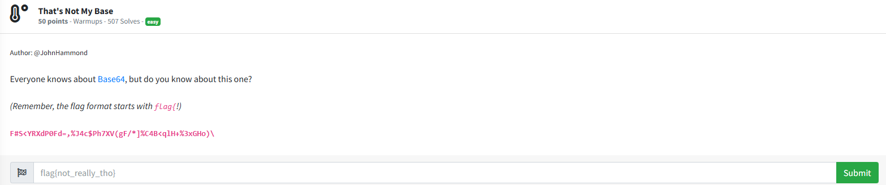

# That's Not My Base

I first tried to decode `F#S<YRXdP0Fd=,%J4c$Ph7XV(gF/*]%C4B<qlH+%3xGHo)\` using CyberChef, but it wasn't able to decode it. Since I keow that the text was encoded in a BASE varient, I researched over the internet in the hopes of finding something that would decode the text for me. I stumbled upon a tool called `BaseCrack` Github user `mufeedvh`. I followed the instructions from the page:

[BaseCrack](
