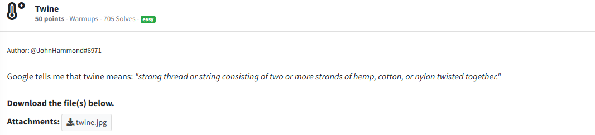
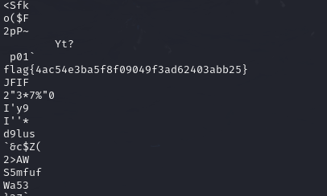

# Twine

The file in question:


Since the file is an image, I can reasonably assume that this is an image steganography challenge. Steganography is the practice of hiding data in images. In a steganography challenge in a CTF, the hidden data is almost always the flag, or something that leads toward progressing deeper into the challenge, ulitimately leading toward the flag. In steganographyy challenges, I almost always use the 

```txt
strings
```
command to see if the flag is hidden in the printable character output of the file. So I executed:

```txt
strings twine.jpg
```
With the result being:



The flag is: 

`flag{4ac54e3ba5f8f09049f3ad62403abb25}`

In retrospect I could've just used 

```txt
strings twine.jpg | grep "flag"
```
As that would have immediately printed out any printable characters within `twine.jpg` that contained the words `flag`, versus having to search through the entire output of the printable characters in the hopes of finding a flag. By using the `grep` command, I would have found the flag faster. If the flag wasn't in the strings output, I wouldn't have spent time analyzing the entire output, as if no matches to the word `flag` occured, nothing would be outputted. 
