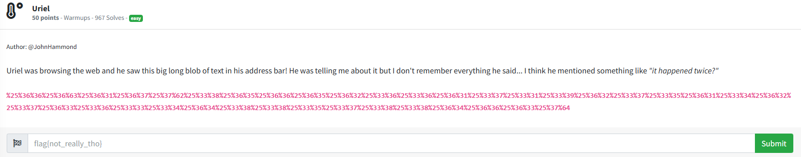
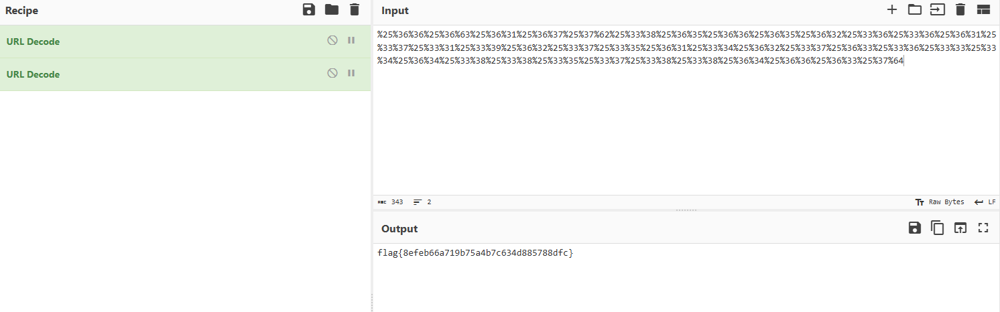

# Uriel

Since the challenge description states that the text 

`%25%36%36%25%36%63%25%36%31%25%36%37%25%37%62%25%33%38%25%36%35%25%36%36%25%36%35%25%36%32%25%33%36%25%33%36%25%36%31%25%33%37%25%33%31%25%33%39%25%36%32%25%33%37%25%33%35%25%36%31%25%33%34%25%36%32%25%33%37%25%36%33%25%33%36%25%33%33%25%33%34%25%36%34%25%33%38%25%33%38%25%33%35%25%33%37%25%33%38%25%33%38%25%36%34%25%36%36%25%36%33%25%37%64`

was found in Uriel's address bar, and that Uriel sounds a lot like URL, I can conclude that this text is URL encoded. The challenge description also mentions "it happened twice" so I can assume that this has been URL encoded two times. Using this information, I went to `CyberChef` (basically a swiss-army knife for CTF related tasks), copied and pasted the text into the input button, and performed `URL decode` twice, resulting in:

I then submitted `flag{8efeb66a719b75a4b7c634d885788dfc}` into the challenge box and solved the challenge.
