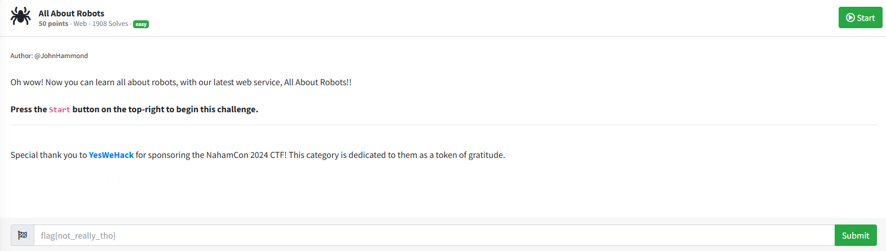

# All About Robots


I press start, which after a couple of seconds, gives me a link to go to. The link takes me to a web page which displays:


Clicking on learn more after clicking on a robot navigates to a page explaining what robots.txt is. According to Cloudflare, robots.txt is a

`file contains instructions for bots that tell them which webpages they can and cannot access. Robots.txt files are most relevant for web crawlers from search engines like Google.`

Since the challenge is called `All About Robots` and mentions `robots.txt`, I can assume that in order to solve this challenge I must access robots.txt. Since I cannot use dirbuster or any automated tools, I first attemepted to see if directory traversal would allow me to access the websites robots.txt file. So I appended

```txt
/robots.txt
```

to the end of the url and pressed enter, which resulted in:


Seems like I need to access `open_the_pod_bay_doors_hal_and_give_me_the_flag.html`. So I removed `robots.txt` from the url and appended 

```txt
/open_the_pod_bay_doors_hal_and_give_me_the_flag.html
```

to the end of the url and pressed enter, which resulted in:


I then submitted `flag{3f19b983c1de42bd49af1a237d7e57b9}` into the challenge box and solved the challenge.


