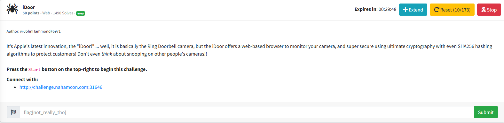

I clicked the link, which led me to a webpage that displayed:

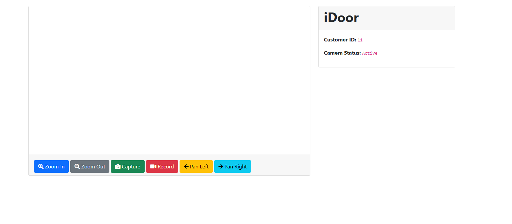

I tried looking through the source code and pressed all the buttons to see if anything would reveal the flag, but nothing came up. I then noticed something interesting in the URL:

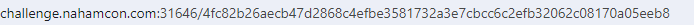

The challenge description mentioned the use of SHA256 hashing. So I put it into a SHA256 decoder online and got a decoded message of 11, which lines up with the customer id. I then wondered if I could “snoop” on different cameras by putting in different hashes?

I inserted `4a44dc15364204a80fe80e9039455cc1608281820fe2b24f1e5233ade6af1dd5` (the SHA256 hash for 10) in the URL where the SHA256 hash for 11 was and pressed enter:

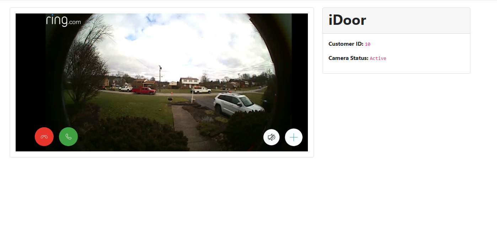

Now knowing how to "snoop" on different cameras, I then decided to enter different hash values from 1-9. 

`6b86b273ff34fce19d6b804eff5a3f5747ada4eaa22f1d49c01e52ddb7875b4b` (SHA256 hash value for 1):

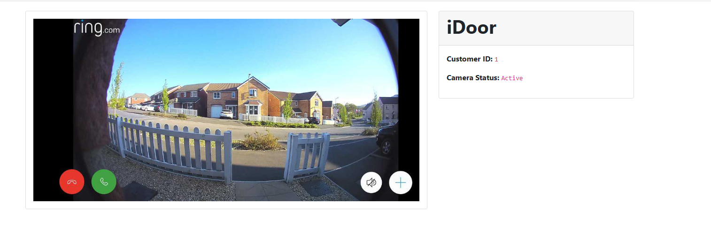

`d4735e3a265e16eee03f59718b9b5d03019c07d8b6c51f90da3a666eec13ab35` (SHA256 hash value for 2):

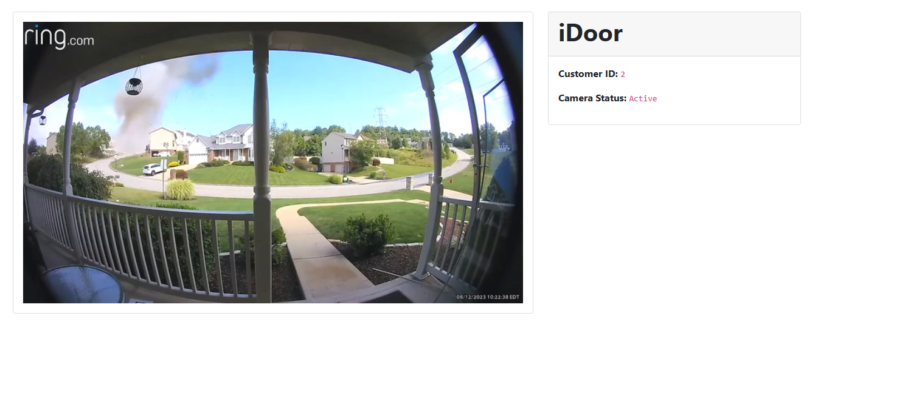

`4e07408562bedb8b60ce05c1decfe3ad16b72230967de01f640b7e4729b49fce` (SHA256 hash value for 3):

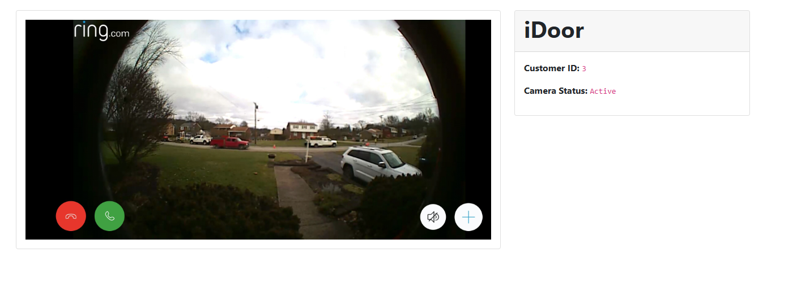

`4b227777d4dd1fc61c6f884f48641d02b4d121d3fd328cb08b5531fcacdabf8a` (SHA256 hash value for 4):

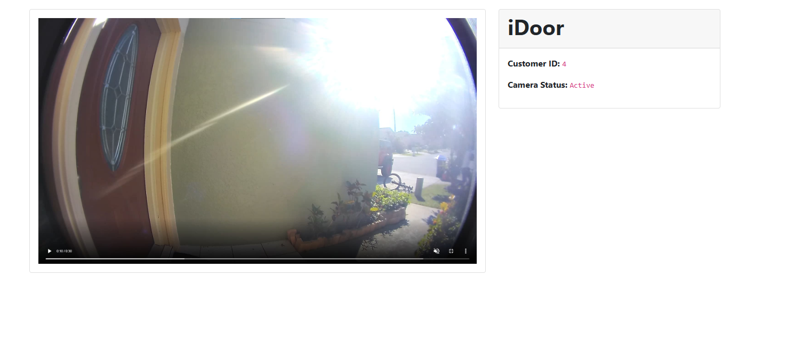

`ef2d127de37b942baad06145e54b0c619a1f22327b2ebbcfbec78f5564afe39d` (SHA256 hash value for 5):

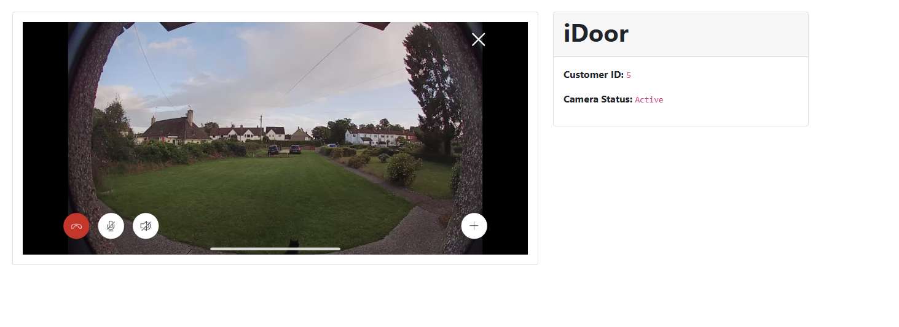

`e7f6c011776e8db7cd330b54174fd76f7d0216b612387a5ffcfb81e6f0919683` (SHA256 hash value for 6):

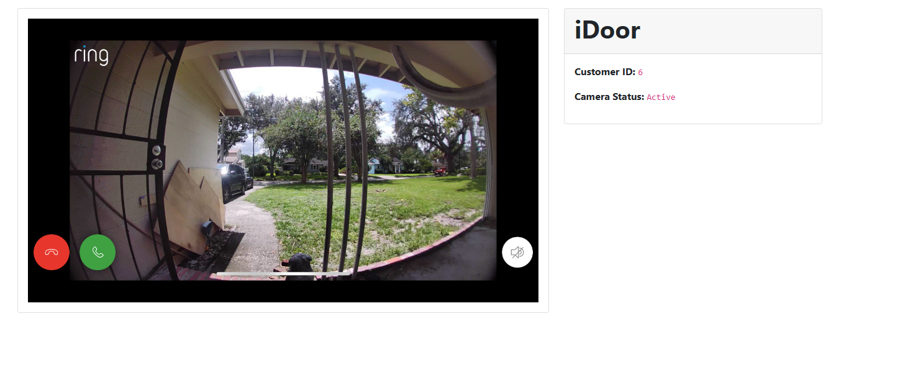

`7902699be42c8a8e46fbbb4501726517e86b22c56a189f7625a6da49081b2451` (SHA256 hash value for 7):

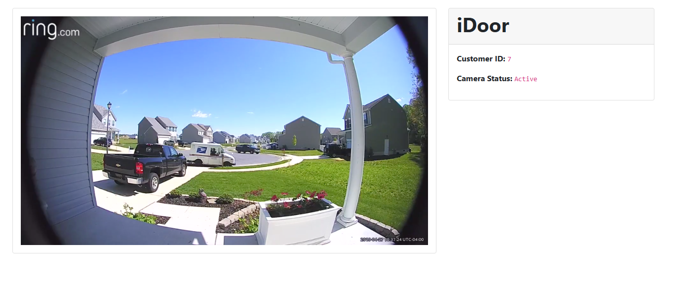

`2c624232cdd221771294dfbb310aca000a0df6ac8b66b696d90ef06fdefb64a3` (SHA256 hash value for 8):

Displayed an error

`19581e27de7ced00ff1ce50b2047e7a567c76b1cbaebabe5ef03f7c3017bb5b7` (SHA256 hash value for 9):

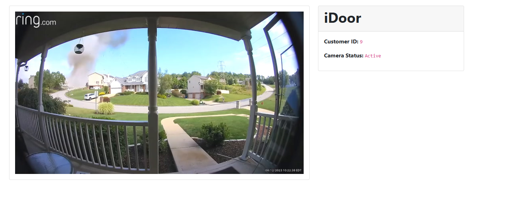

Nothing came up. I was then stumped for quite a bit. I then realized I never tried inputting the SHA256 hash for 0, so:

`5feceb66ffc86f38d952786c6d696c79c2dbc239dd4e91b46729d73a27fb57e9` (SHA256 hash value for 0)

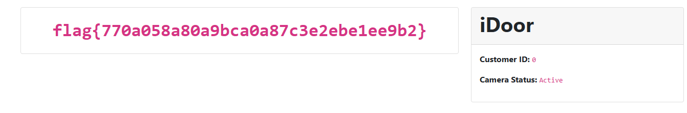

I then submitted `flag{770a058a80a9bca0a87c3e2ebe1ee9b2}` into the challenge box and solved the challenge.
