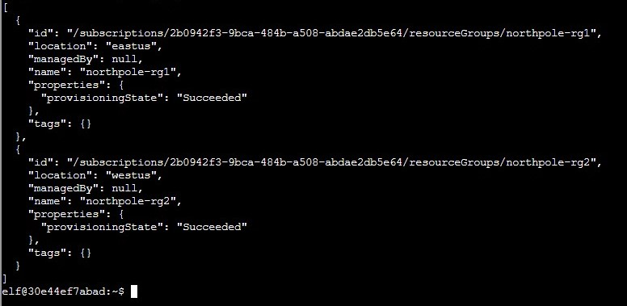
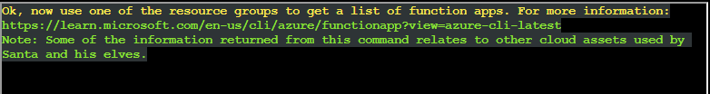

# Preface


Challenge description: Help Sparkle Redberry with some Azure command line skills. Find the elf and the terminal on Christmas Island.

Location : Christmas Island - Rudolph's Rest Resort

Difficulty : 2 out of 5 trees


# Azure 101
Hey another 101 challenge. This time it is about Azure. Unfortunately for me, I don't know anything about Azure. But isn't that what CTF's are about, learning? Hopefully it doesn't take as long as Linux 101! Let's go.

The first challenge in Azure 101 is:


In order to solve this challenge, I did what I was told to. 

```txt
az help | less
```

Which resulted in the output of the help page, which looks like this:


I then unlocked the next challenge:


It took me a bit before I realized I had to type `q` in order to exit the help page. Yeah. Anyway in order to solve the challenge I used the context clues of each highlighted " " word to type:

```txt
az account show | less
```

Which displayed:


I then unlocked the next challenge:


First I typed `q` to exit out of the page. Since I didn't know anything about Azure, I went to the linked page. There I used "ctrl-f" to search for "list resource groups" and got:


Using this information, I typed: 

```txt
az group list
```

Which displayed:



I then unlocked the next challenge:



I didn't find a command that worked, so I asked ChatGPT:


It responded with


Using this information I typed:

```txt
az functionapp list --resource-group northpole-rg2
```
Which was denied. So I changed my command to be:
```txt
az functionapp list --resource-group northpole-rg1
```
Which resulted in:


I then unlocked the next challenge:


I then looked at the Azure documentation, where I found this command:


So I modified that command to be:
```txt
az vm run-command invoke -g northpole-rg2 -n NP-VM1 --command-id RunShellScript --scripts 'ls'
```
Which resulted in:


I then got:


Done.


