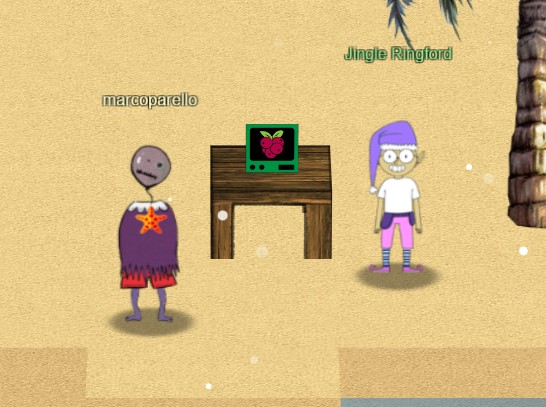
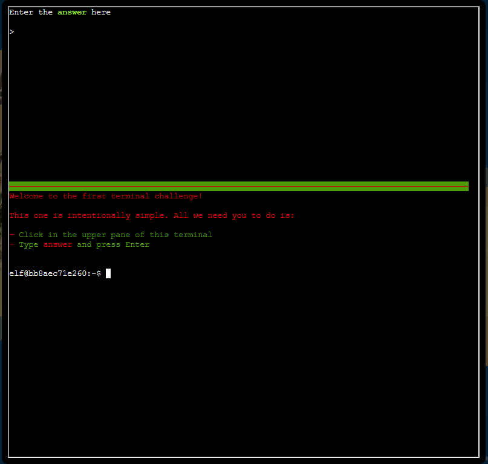

# Preface

Challenge description: Talk to Jingle Ringford on Christmas Island and get your bearings at Geese Islands

Location: Christmas Island - Orientation

Difficulty : 1 out of 5 trees

# Holiday Hack Orientation
This is the first challenge that I encountered in Kringlecon 2023. It is the first challenge that the player will encounter. It is also the easiest.

As directed, in order to solve this challenge, simply type "answer" into the terminal and hit the enter key.
The actual process for me was like this:
1. Click the flashing portion of the terminal with my mouse (it feels wrong using a mouse in order to interact with a terminal)
2. Type "answer" on my mechanical keyboard
3. Press the "enter" key on my mechanical keyboard
4. Profit

