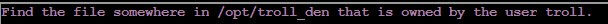

# Preface


Challenge Description: Visit Ginger Breddie in Santa's Shack on Christmas Island to help him with some basic Linux tasks. It's in the southwest corner of Frosty's Beach.

Location: Christmas Island - Santa's Surf Shack

Difficulty: 1 out of 5 trees


# Linux 101
Oh boy this was a long one. With 22 tasks to complete (23 if you can't the exit task), it is a gauntlet. But without further to do, lets go!


To start the gauntlet, I must type `yes` on my keyboard and hit the `enter` key.


In Linux, the `ls` command lists all the files in a directory. Since the task is to perform a directory listing of the home directory, I can assume that the `ls` command is the answer. For example, if I was in a directory called dummy and wanted to see all the files in dummy, I would execute 
```txt
ls dummy
```
and the output would be the files that are in dummy.

So I typed `ls` on my keyboard and the result was:


I now must find the troll inside the troll. This can be accomplished with the `cat` command. In Linux, the `cat` command is used to display the contents of a file on the terminal. For instance, if I had a file named "cow" which had the word "moo" written to it, if I ran the command `cat cow` (assuming that the current directory I was in is the directory that contains the "cow" file), then "moo" would be displayed on my terminal after I execute the command. Since the file name for the troll is `troll_19315479765589239`, the command I would need to execute is:
```txt
cat troll_19315479765589239
```
After I executed the command, the result was:


I then unlocked the next challenge:


In order to remove a file in Linux, the `rm` command is used. The `rm` command only works if the file that is to be removed is in the current working directory. Let's say that I had a file named "notavirusiswear.exe" and I wanted to remove it from my system. I would execute the command
```txt
rm notavirusiswear.exe
```
which would remove the file. If I had used the `ls` command before, it would show that the "notavirusiswear.exe" is still in the directory. However, after I executed the `rm notavirusiswear.exe` and then executed the `ls` command, "notavirusiswear.exe" would be gone.

With my understanding of the `rm` command, I typed

```txt
rm troll_19315479765589239
```

I then unlocked the next challenge:


In order to print the present working directory in Linux, the `pwd` command is used. For example, if I was working in the "idea" directory, executing the command `pwd` would result in "idea" being printed to the terminal. Therefore, I simply typed

```txt
pwd
```
After I executed the command, the result was:

 

I then unlocked the next challenge:


In order to display hidden files in Linux, use the `ls` command with the `-a` flag. The `-a` includes hidden files and directories in the output of the `ls` command. For example, lets say I had 2 files in the "cow" directory. One of them is named "moo1.jpg" while the other is named "moo2.jpg". The file "moo1.jpg" is a non-hidden file, while "moo2.jpg" is a hidden file. If I executed the `ls` command, only moo1.jpg will be displayed in the output despite the existence of moo2. However, if I executed 

```txt
ls -a
```

The output would include both "moo1.jpg" and "moo2.jpg"

Therefore, I typed

```txt
ls -a
```
After I executed the command, the result was


I then unlocked the next challenge:


In Linux, your command history is stored in the `.bash_history` file. `bash_history` is a hidden file so it has a `.` at the start. As a result, it can only be seen with `ls -a` command if the user usese `ls` to list files on their system. Since the `.bash_history` file in the system I am currently working on is in the same working directory as I am, I simply type:

```txt
cat .bash_history
```
After I executed the command, the result was


I then unlocked the next challenge:


In Linux, the `printenv` command is used to display the enironmental variables of the system. With this information, I typed:

```txt
printenv
```

After I executed the command, the result was


It's not exactly pretty. Eh we can't all be beautiful like MacOS I guess.

Anyway with the abomination out of the way, I unlocked the next challenge:


I now need directories. In order to change directories in Linux, use the `cd` command. For example, if I wanted to change from the "moo" directory to the "moomoo" directory, and the "moomoo" directory was in the same working directory as the current directory, I would use the command 

```txt
cd moomoo
```

I am now in the "moomoo" directory. If I wanted to go back on the directory chain, I would use

```txt
cd ..
```

Which would move you back one directory

Using this information, I typed

```txt
cd workshop
```
I then used the `ls` command, as ls'ing after entering a new directory is like a second nature to me. I was greeted with


Oh boy. Thats a lot of toolboxes

I then unlocked the next challenge (well I did unlock it after I typed `cd workshop` )


This challenge requires the `grep` command to be used. The `grep` command searches for patterns in text. If found, it highlights the patterns in it's output. That is the default `grep` behavior without using any flags.  However, it also has optional flags that you can chain to do a lot of crazy searches. In order to solve the challenge, I typed:

```txt
grep -Rin "troll" .
```
The `-Rin` flag is a combination of the `-R`, `-i`, and `-n` flags for `grep`. The `-R` flag performs a recursive search, aka looking through the current directory and it's subdirectory. It will only stop once there aren't any more directories to traverse. The `-i` flag tells `grep` to perform a case-insensitive search, meaning that casing doesn't matter. As long as `grep` finds patterns that match the words for the target query, it will highlight the pattern. The `-n` flag tells `grep` to display number lines in it's output. I didn't have to put this flag in but I wanted to because it looked nice. Finally the `.` tells `grep` to start the search in the current directory. After I executed `grep -Rin "troll"`, the result was:


Which unlocked the next challenge:


Since the `present_engine` binary file is already in my `/usr/local/bin` directory (I checked it before while trying to solve this challenge originally), I don't have to do multiple `cd ..` or `cd` commands to go the directory where `present_engine` is located. Since binary files almost always never have execute permissions by default, I typed:

`chmod +x present_engine`

The `chmod` command changes permissions for files. The `+x` flag adds the "execute" permission to a file, allowing the file to be run by the user. Finally, `present_engine` is the target file for chmod. Now that `present_engine` is an executable file, I type:

`./present_engine`

The `./` command in Linux is used to run executable files from the current directory. Since `present_engine` is in the `/usr/local/bin` directory, I can run it from any location in my system. Because I want to run `present_engine` from the current directory, I used the aformentioned command. After I ran `./present_engine` command, I unlocked the next challenge:


To solve this, I first typed:

```txt
cd electrical
```

The `mv` command in linux is used for moving files and directories, but it also can be used to rename files. The syntax for renaming files is as follows: `mv <oldname> <newname>`. Using this information, I typed:

```txt
mv blown_fuse0 fuse0
```

Which immediately unlocked the next challenge:


A symlink in Linux is basically a shortcut in Windows. In order to create a symlink, I must use the `ln -s` command. The `ln` command creates links to files in Linux, while the `-s` flag tells `ln` to make the link a symlink. Using this information, I typed the command:

```txt
ln -s fuse0 fuse1
```
Which immediately unlocked the next challenge:


In Linux, the `cp` command is used to copy files. The syntax is as follows `cp <original_file> <copy_file>`. Using this information, I typed:

```txt
cp fuse1 fuse2
```
Which immediately unlocked the next challenge:


The `echo >>` command is used to add text to a file in Linux. The `echo` command is used to output text in the terminal, while the `>>` option signifies appending an output to a file. Using this information, I typed:

```txt
echo TROLL_REPELLENT >> fuse2
```
Which immediately unlocked the next challenge:


Remember earlier when I said at least I don't have to run multiple `cd` or `cd..` commands. Yeah. Anywhere in order to get to /opt/troll_den, I typed:
```txt
cd ..
cd ..
cd ..
cd opt
cd troll_den
```

Since I needed to "find" a file that is a troll somewhere, I typed:

```txt
find -iname troll*
```

The `find` command in Linux is used to locate files. The `-iname` flag is used in `find` to specify that the casing of the word doesn't matter. As long as the characters are the same, count a file that contains the word as a match. Finally, the `troll*` portion looks for a file with the word "troll" in it, with the `*` being a wildcard (bascially any character or characters) that come after "troll". After I executed the command, the result was:


I then unlocked the next challenge:



Now I need to "find" the file in troll_den that is owned by the "user" troll. To do this, I typed:

```txt
find . -user troll
```

The `find` searches for files , the `.` specifies the current directory to be searches, the `-user` tells find to look for files owned by a specfic user, and `troll` specifices that user for which we are looking for their files. After I executed the command, the result was:


I then unlocked the next challenge:


In order to do this, I typed:

```txt
find . -size +108k -size -110k
```

The `find` searches for files, the `.` specifies the current directory to be searched, the `-size` flag tells `find` to look for files that are a certain size, the `+108k` specifies to look for files that are greater than 108 kilobytes, the second `-size` flag sets the boundary for the max size, and the `-110k` specifies to look for files that are less than 110 kilobytes. After I executed the command, the result was:


I then unlocked the next challenge:


The `ps` command is used to display current running processes. However, the `ps` command also has additional flags that can be used to expand or narrow the search. Using this information, I typed:

```txt
ps -ef
```

I chained the `-e` and `-f` flags together to create `-ef`. The `e` flag specifies **all** processes, not just the current running ones. The `-f` flag provides basically all the details about the process, like the parent-child relationship. The `-f` flag is very helpful for identifiying the specific commands or programs that are associated with each process, which is great if you want to find out the root cause of why a process is running. After I executed the command, the result was:


I then unlocked the next challenge:


Since I need to display information surrounding networking, I need to use the `netstat` command. The netstat command in Linux is used to basically just display information about networking and network-related activities on the system. However, since we only want to display only active TCP listening ports, we will have to use the chained flag `-ntl`. The `-n` flag displays ip addresses and port numbers in a numeric form instead of resolving them to hostnames, which helps with speed and clarity. Also because I think it looks nicer. The `-t` flag filters the output of `netstat` to display only TCP connections. Finally, the `-l` flag filters the output of `netstat` to display only listening ports. When we combine the flags together we get `-ntl`. So I typed:

```txt
netstat -ntl
```
Which outputted:


I then unlocked the next challenge:


Since I want to interact with a server, I will need to use the `curl` command. The `curl` command in Linux is a way to interact with servers over the internet. Think of it like a text-based web browser. You can download files, get information, and send data to a server using `curl`. So I typed:

```txt
curl 0.0.0.0:54321
```

The `0.0.0.0` is the ip address of the server that we want to interact with. The `:54321` specifies the port of the server. After I executed the command, the output was:


I then unlocked the next challenge:


Since I only know the name of the `14516_troll` processes and not it's process id, I will use the `pkill` command. The `pkill` command in Linux is used to stop (kill) a process by specifying it's name, not it's PID. So I typed:

```txt
pkill 14516_troll
```

Which then ended 14516_troll's free trial of living. 


I then unlocked the next "challenge"


Simple. Its time for me to make my `exit`.

```txt
exit
```

Done. The gauntlet is finished. 


