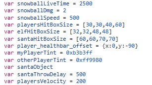

# Preface


Challenge Description: Visit Christmas Island and talk to Morcel Nougat about this great new game. Team up with another player and show Morcel how to win against Santa!

Location: Christmas Island - Frosty's Beach

Difficulty: 2 out of 5 trees


# Snowball Fight
In order to beat this challenge, you simply have to defeat Santa in a snowball fight with another player. No challenge here, simply play the game and win. Luckily, since I had around 350 hours in Monster Hunter World, I was very good at dodging the snowballs thrown by Santa. It was hard to take him down, but eventually, I was able to accomplish the task with another player. Turns out "git gud" is actually pretty good advice. 

Of course, because the game is stored on the client side, there are some l33t hax0r tricks you can do to make the game easier (or harder if you want to have internet bragging rights).
## Single-player Mode
The game hints that there is a single-player mode. Of course, the game is currently set to multiplayer only. But because everything is stored on the client side, we can change that. In order to make single-player mode available, create a private room. 


Before you click the big red start button, open up the console in your browser devtools, and make sure that it is set to "\room" (I made this mistake way too often before I realized what I was doing wrong). Then, type:
```txt
window.location.href  
```
And you should get this output:


Notice how at the end of the line the variable `singlePlayer` is set to `false`. We want to change that if we want to access single-player mode. So copy and paste the entire text, then type:
```txt
window.location.href =
```
and paste the text to be after the equal sign. Make sure to put the `'` marks at the beginning and the end of the text you just pasted. Then go to the end of the text and change `singlePlayer=false` to `singlePlayer=true`. Then press enter to execute your code and the window where the game is located will refresh. Once that happens, you will be greeted to the same welcome screen with the ready button. This time, click it. The game will start and a couple seconds later you will get a message that "Elf the dwarf has joined your team". 


And with that, you now are able to play the game in single-player mode.
## Manipulation of Game Variables
This trick works in multiplayer as well. After you start a game, navigate to the sources section of your devtools and follow this chain:


Click on the file that is highlighted in the blue. This will open the file in your dev tools. If you scroll down a bit, you will see this portion of the code:



Since the game is on the client side, we can modify these variables. For example, in this image, I modified the elf snowballs to not do any damage to me.


All you need to do is type in the name of the variable in the console (make sure that it is set to room on the top. If it isn't the changing of the variables won't have any effect on the game) and set it to any value that you desire. Since I wanted to make the enemy snowballs not do any damage, I executed `snowballDmg = 0`. I then proceeded to win the game in under a minute. However, as stated before, in order to complete the challenge, you must beat Santa with another player. But it is fun to play around and modify the code in singleplayer :)


