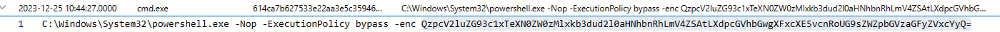

# KQL Kraken Hunt
This had to be the challenge that took the longest for me to complete. It took a couple days. It is basically 5 challenges. Here we go

## Welcome to SANS Holiday Hack 2023!

To begin the challenge, I had to complete the onboarding portion. This meant I had to make an azure account, get a free cluster, and then type the commands instructed to me to set up the challenge. I didn't screenshot this for privacy concerns. After I finished the onboarding portion, the first task was to find: 

`How many Craftperson Elf's are working from laptops?`

I then typed this KQL query:
```txt
Employees
| where role == "Craftsperson Elf"
| where hostname has "LAPTOP"
| summarize dcount(hostname)
```
The query looked in the `Employees` table. In the table it looked in the `role` column for values that were equal to the string "Craftsperson Elf". Once that was done, it then sorted through that data to find values in the `hostname` column that contained the string "LAPTOP". Finally, it then summarized the amount of data by the unique hostname (dcount is distinct count. Only unique entries are counted). After this was done, the number 25 was outputted to me in the console. I then inputted 25 as my answer, and got a credly badge:


Apparently this is an "NFT" badge (remember those). Not sure why exactly but i'll take it. Anyway since creditionals from Credly can be added to my Linkedin creditionals section, I did what had to be done. 
## Welcome to Operation Giftwrap: Defending the Geese Island network


For this case, I need to find:

`What is the email address of the employee who received this phishing email?`

`What is the email address that was used to send this spear phishing email?`

`What was the subject line used in the spear phishing email?`

Since `link` is a column in the `Email` table, and the case description gave me a malicious link, I typed this KQL query:
```txt
Email
| where link == 'http://madelvesnorthpole.org/published/search/MonthlyInvoiceForReindeerFood.docx'
```
This KQL searches the `Email` table for the value in the `link` column that is **exactly** equal to the string "http://madelvesnorthpole.org/published/search/MonthlyInvoiceForReindeerFood.docx". The result obtained by the query was:


The image shows that the `sender` column contains the string "cwombley@gmail.com", the `recipient` column contains the string "alabaster_snowball@santaworkshopgeeseislands.org" (when double clicked on as it is too large to display with the current column length), and the `subject` column contains the string "[EXTERNAL] Invoice foir reindeer food past due". We now can answer the questions asked:

`What is the email address of the employee who recieved this phishing email?  = alabaster_snowball@santaworkshopgeeseislands.org`

`What is the email address that was used to send this spear phishing email? = cwombley@gmail.com`

`What was the subject line used in the spear phishing email? = [EXTERNAL] Invoice foir reindeer food past due`

I then submitted my answers into the answer column, and the result was:


Onto the next case!

## Someone got phished! Let's dig deeper on the victim...


For this case, I need to find:

`What is the role of our victim in the organization?`

`What is the hostname of the victim's machine?`

`What is the source IP linked to the victim?`

Since I know that the name of the employee is "alabaster" and the table `Employees` has a name column, I typed this KQL query:

```txt
Employees
| where name has "alabaster"
```
The result obtained by the query was:


Looking at the entry, I saw that the in the `role` column contains the string "Head Elf". Additionally, the `hostname` column contains the string "Y1US-DESKTOP". Finally, the `ip_addr` column contains the address "10.10.0.4". With this information, we now can answer the questions asked:

`What is the role of our victim in the organization? = Head Elf`

`What is the hostname of the victim's machine? = Y1US-DESKTOP`

`What is the source IP linked to the victim? = 10.10.0.4`

I then submitted my answers into the answer column, and the result was:


Onto the next case!

## That's not good. What happened next?


For this case, I need to find:

`What time did Alabaster click on the malicious link? Make sure to copy the exact timestamp from the logs!`

`What file is dropped to Alabaster's machine shortly after he downloads the malicious file?`

To solve this, I first needed to figure out which table would contain the event when Alabaster clicked the malicious link. After thinking for a couple minutes, I realized that clicking a link to download a file would send a request to a server **outside** of the network. The server's response would then be sent **to** the network. With that realization, I typed the KQL query:

```txt
OutboundNetworkEvents
| where src_ip has "10.10.0.4"
```
This query searches entries in the `OutboundNetworkEvents` table that have the string "10.10.0.4" in their `src_ip` column. After the entire table has been read, the result is then returned. Of course, since there were multiple entries, I had to scroll through the data for a bit before I encounted this entry:


Looking at the entry, I see that this was a GET request to a server. A GET request is used to request data from the server. From examination, I see that the link shows the phishing file `MonthlyInvoiceForReindeerFood.docx`. Since the phishing file is being requested by Alabster's ip_address to the server, I concluded that the timestamp shown in this entry must be the timestamp when Alabaster clicked on the malicious link. I then copied and pasted the timestamp into the answer box, which then displayed

`What time did Alabaster click on the malicious link? Make sure to copy the exact timestamp from the logs! = 2023-12-02T10:12:42Z`

I still had one question left to answer. Since there was a table named `FileCreationEvents`, I concluded that since after clicking a malicious link that would "drop" (create) a file on his machine, the answer must be in an entry in that table. So I typed the KQL query:

```txt
FileCreationEvents
| where username has "alsnowball"
```
This query searches the `FileCreationEvents` table for entries that have the string "alsnowball" in the `username` column. After all of the entries have been searched, the result is displayed. Since there were a lot of matching entries, I had to look through the data for a bit before I encounted this entry:


Looking at the entry, I saw that the file `giftwrap.exe` was created by `explorer.exe`. Since `giftwrap.exe` sounds like a malicious file, and all the other entries had non-malicious files (like word documents and what not), I concluded that `giftwrap.exe` was the malicious file that was "dropped" to Alabaster's machine after he clicked the malicious link. Therefore:

`What file is dropped to Alabaster's machine shortly after he downloads the malicious file? = giftwrap.exe`

I then submitted my answers, and the result was:


Onto the next case!
## A compromised host! Time for a deep dive.


For this case, I need to find:

`The attacker created an reverse tunnel connection with the compromised machine. What IP was the connection forwarded to?`

`What is the timestamp when the attackers enumerated network shares on the machine?`

`What was the hostname of the system the attacker moved laterally to?`

From past experience, I know that the `cmd` process can be used to create a reverse tunnel connection. Additonally, the reverse tunnel connection was made using Alabaster's machine, so the hostname would be `Y1US-DESKTOP`. I then typed the KQL query:

```txt
ProcessEvents
| where hostname has "Y1US-DESKTOP"
```
This query looks at the entries in the `ProcessEvents` table which have the string "Y1US-DESKTOP" in their `hostname` column. After all the entires in the table are checked, the result is returned. Looking at the entires that were returned, I came across this "interesting" entry:


When I expanded the command, I saw that a source address was being forwarded to `113.37.9.17`. To make sure that this was the correct answer, I skimmed through all of the other entries. I couldn't find any other similar command in the entires that were returned by my query, so I inputted this answer:

`The attacker created an reverse tunnel connection with the compromised machine. What IP was the connection forwarded to? = 113.37.9.17`

I still have two questions left. Since this entry was when the attackers used a reverse tunnel connection, they must have enumerated network shares later. I also know that the cmd command `net share` enumerates network shares. Therefore I used the timestamp from the entry to create this KQL query:

```txt
ProcessEvents
| where timestamp > datetime(2023-12-02T11:11:29Z)
```
This query looks for entries in the `ProcessEvents` table that have a timestamp in the `timestamp` column that is greater than "2023-12-02T11:11:29Z". Again, since there were a lot of entries, (looking back it was probably better to make more specific entries) I had to do some digging through the data before this entry came up:


Since this entry was the only usage of the `net share` command from the filtered data, I had my answer:

`What is the timestamp when the attackers enumerated network shares on the machine? = 2023-12-02T16:51:44Z`

One question left. Now I just need to find the hostname of the system the attacker moved laterally to. I looked through the data. But nothing came up. Any hostname that I entered was inccorect. Then I realized something: a server is a hostname. I remembered this entry that I found while I was searching using the same KQL query as before:


The usage of the cmd commands to access (move to)  `NorthPolefileshare` gave it away. The hostname that I was looking for wasn't in the `hostname` column of the entry. Instead, it was hiding in plain sight the whole time. The attackers are using Alabaster's computer to access the NorthPolefileshare server. Therefore:

`What was the hostname of the system the attacker moved laterally to? = NorthPolefileshare`

I submitted my answers, and the result was:


Onto the next case!


## A hidden message


For this case, I need to find:

`When was the attacker's first base64 encoded PowerShell command executed on Alabaster's machine?`

`What was the name of the file the attacker copied from the fileshare? (This might require some additional decoding)`

`The attacker has likely exfiltrated data from the file share. What domain name was the data exfiltrated to?`

Using my knowledge that "cmd.exe" was in the "ProcessEvents" table, the computer that is being used by the attackers is "Y1US-DESKTOP", and powershell can encode commands, I typed the KQL query:

```txt
ProcessEvents
| where hostname has "Y1US-DESKTOP"
| where process_name has "powershell.exe"
```
This query looks in the `ProcessEvents` table to search for entries where the `hostname` column contains the string "Y1US-DESKTOP" and the `process_name` column contains the string "powershell.exe". The entire table is then searched. Once the last entry is searched, the results are displayed. There were a couple of Base64 encoded powershell commands as the results. To decode them, I used the website `cyberchef.com` with the option of `From Base64`. Most were red herrings, as they were non-malicious commands. Therefore they weren't done by the *attackers*. However, when I came across:


and put it into cyberchef


I noticed that some of the text looked backwards. So I added the `Reverse` option, which resulted in:


The attackers are copying the NaughtyNiceList! That's not good. Well at least I now have my answers for two of the questions.

`When was the attacker's first base64 encoded PowerShell command executed on Alabaster's machine? = 2023-12-24T16:07:47Z`

`What was the name of the file the attacker copied from the fileshare? (This might require some additional decoding) = NaughtyNiceList.txt`

I then decoded the remaining powershell commands, but none of them came up with a domain. So I went back to the drawing board. I realized two things: 
1. I should refine my search to be after the first powershell command was executed by the attackers. In the event that two commands were somehow executed at the same time, I should also include the timestamp when the attackers executed the first powershell command.
2. Since using "powershell" as the process_name isn't finding the domain name, why not use cmd?
I then proceeded to type a new KQL query

```txt
ProcessEvents
| where timestamp >= datetime(2023-12-15T11:20:14Z)
| where process_name has "cmd.exe"
| where hostname has "Y1US-DESKTOP"
```
This query searches the `ProcessEvents` table for entries that have a timestamp in the `timestamp` column that is greater than or equal to the timestamp (basically at or after the time) 2023-12-15T11:20:14Z. Additionally, the entry must contain the string "cmd.exe" in the process_name column. Finally, the `hostname` column must contain the string "Y1US-DESKTOP". After all entries in the table have been searched, the results are returned. This is a great example of a more specific KQL query. Interestingly, this query returned some powershell commands, which I decoded. When I came across this powershell command:


The string of text looked interesting. So I copied and pasted it into cyberchef with the `From Base64` option, which resulted in:


Which is an ASCII array. Interesting. Since `decode.fr` can convert ASCII characters to text, I decided to go there. So I then copied and pasted the array into decode's ASCII converter, which resulted in:


Ladies and gentlemen, we got him. I now have the answer to the last question:

`The attacker has likely exfiltrated data from the file share. What domain name was the data exfiltrated to? = giftbox.com`

I then submitted my answers, and the result was:


Onto the last case!
## The final step!


For this case, I need to find:

`What is the name of the executable the attackers used in the final malicious command?`

`What was the command line flag used alongside this executable?`

Using my last query, I continued to decode the powershell commands until I came across:



Which I copied and pasted into cyberchef with the `From Base64` option:


Let's try a closer look 


Oh no. 

On the bright side I got the answers to the questions (yay?):

`What is the name of the executable the attackers used in the final malicious command? = downwithsanta.exe`

`What was the command line flag used alongside this executable? = --wipeall`

I submitted my answers, and the result was:


Hey another NFT Credly badge! Hopefully the market doesn't crash before the challenge becomes available. That would suck wouldn't it? Anyway I put my entire life savings into NFT's let me check their value right now. Oh no. 

Note - Hopefully Santa Claus has working backups because those files are **GONE**


## Congratulations!


For this "case", I need to enter:

`print base64_decode_tostring('QmV3YXJlIHRoZSBDdWJlIHRoYXQgV29tYmxlcw==')`

As a KQL query. So I did, and the result was:


I then went to the objectives page, and entered 

`Beware the Cube that Wombles`

I then submitted it, and the result was:


Done


