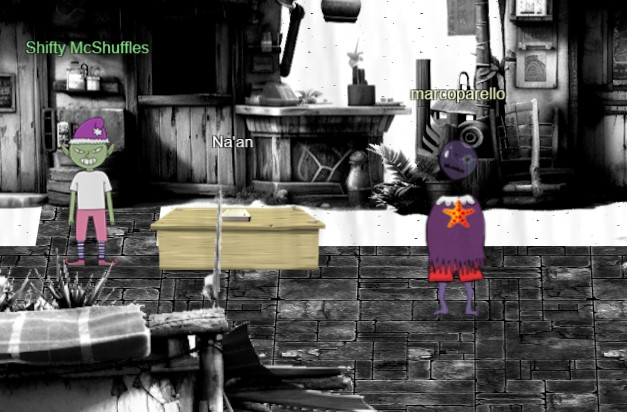
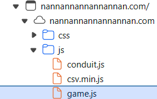
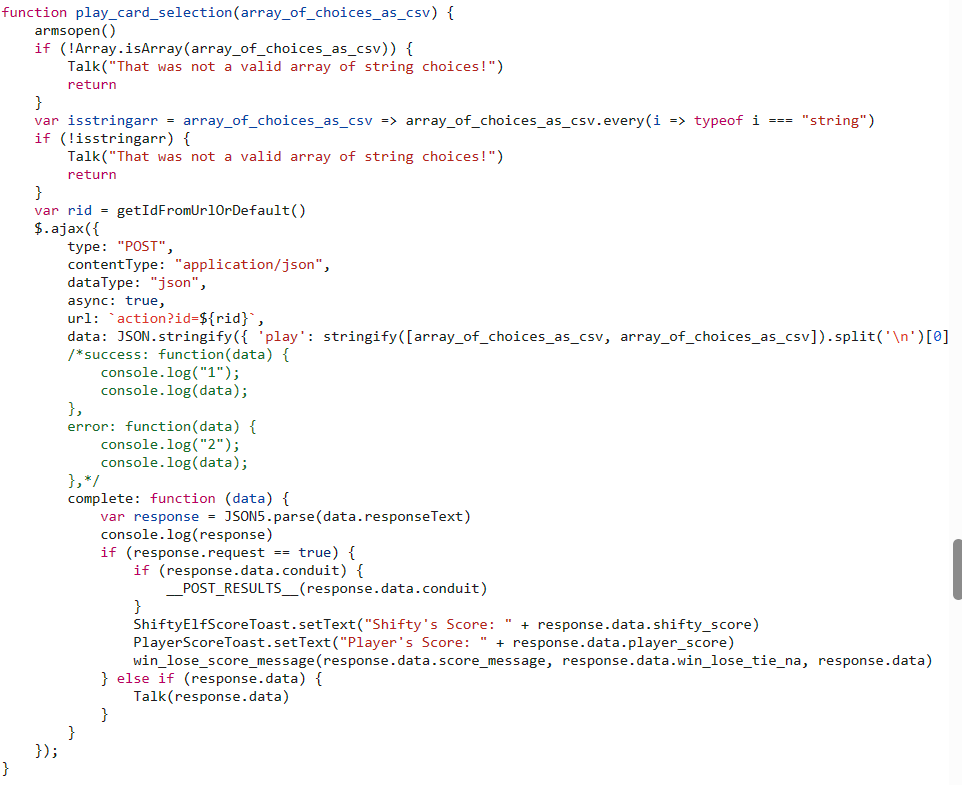

# Preface


 Challenge Description: Shifty McShuffles is hustling cards on Film Noir Island. Outwit that meddling elf and win!

 Location: Film Noir Island - Chiaroscuro City

 Difficulty: 2 out of 5 trees
 
 # Na'an
 NaN in computing is basically not a valid number. In this challenge I am competing in a rigged game. Shifty the elf will always change his cards during the game so he **always** wins. Luckily for me, I have an ace up my sleeve..

 In my devtools, I went to the sources tab, and then opened game.js (the path is showed in the image below) :

 

 I then navigated to this part:

 

 This is where I have an ace up my sleeve. The program only checks if the number is a valid number **while** it is being entered. It doesn't check when the game actually starts to see if the number has changed. Also the game is stored on the client-side. Remember Snowball Fight? Since a NaN is not a number, we will **immediately** gain points, as the game isn't programmed to react correctly if the number input is NaN **during** the game. It will automatically default to the player win condition for the match. Since `play_card_selection(array_of_choices_as_csv)` stores the card value as a list, and there are 5 cards, we simple input in the console (as usual, make sure the console is set to the window where Na'an is being played or else this won't work):

 ```
play_card_selection([NaN,NaN,NaN,NaN,NaN])
```

After I executed this in the console, I won the match. I kept inputting this in the console until I won the game, which caused the challenge to be completed.
 

 
