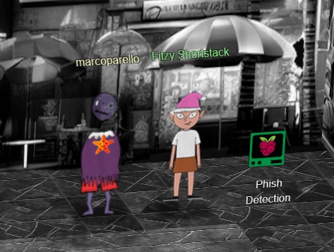
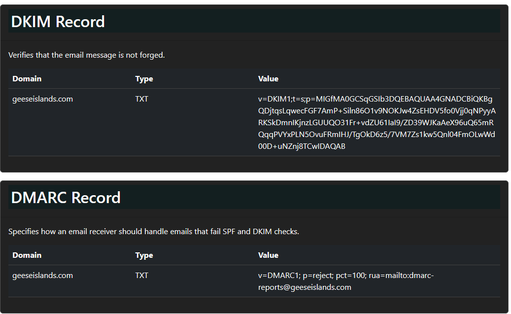
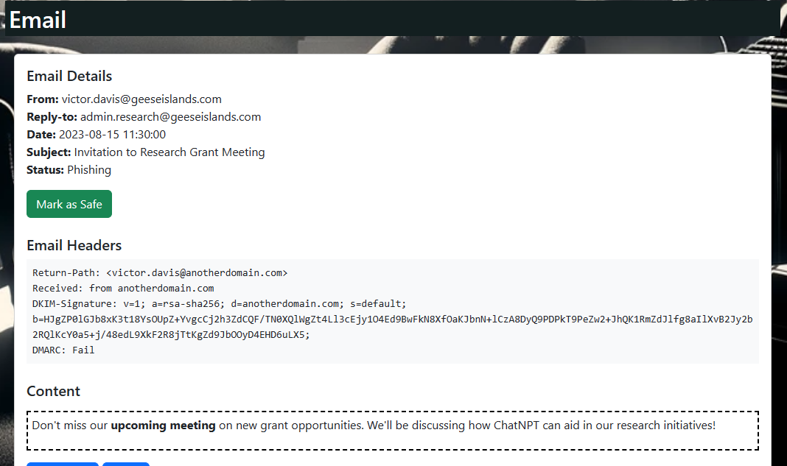
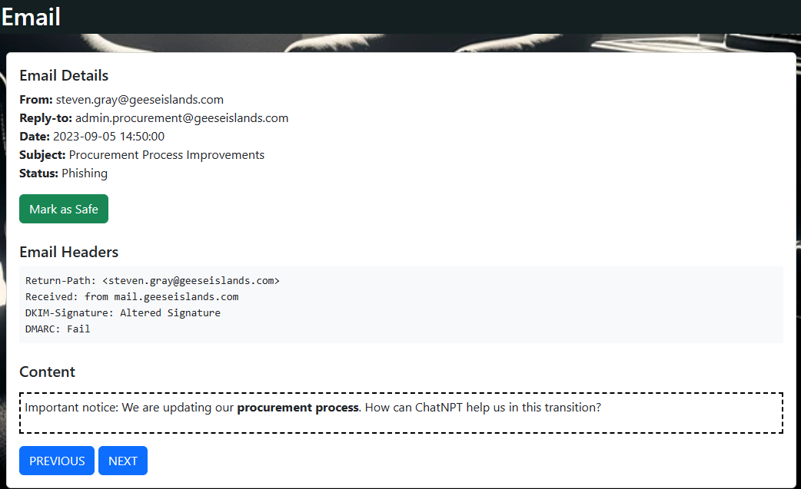
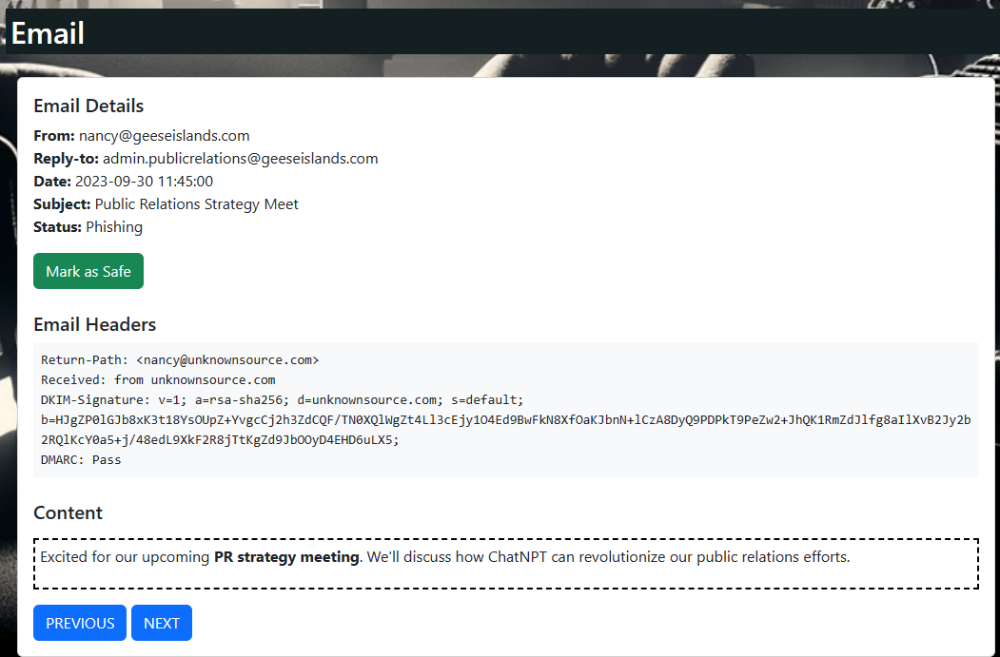
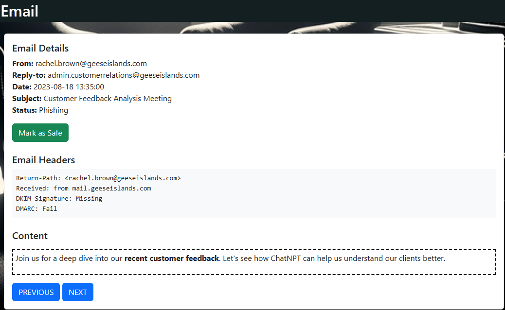
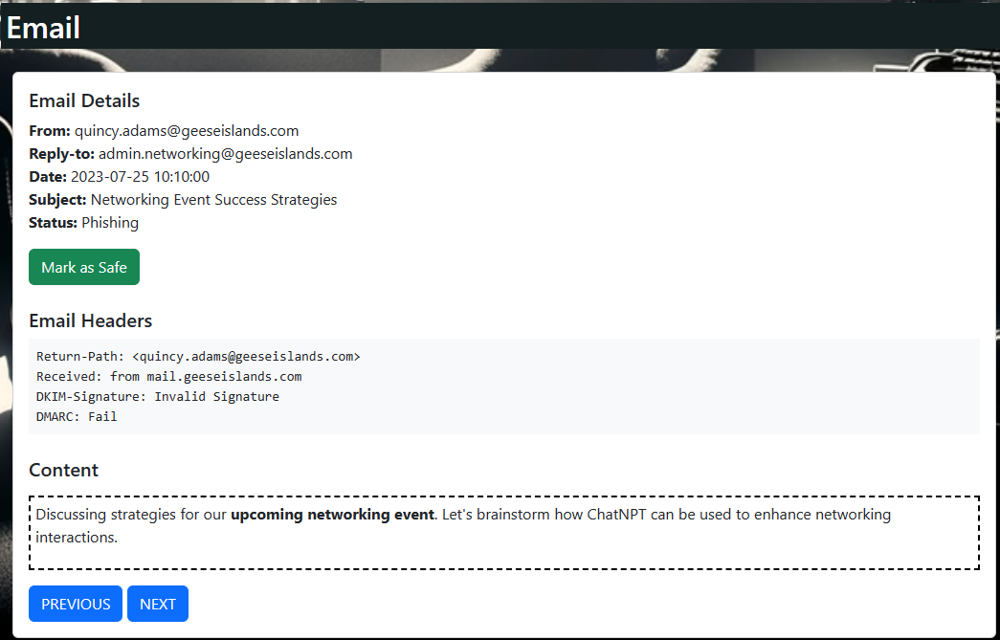
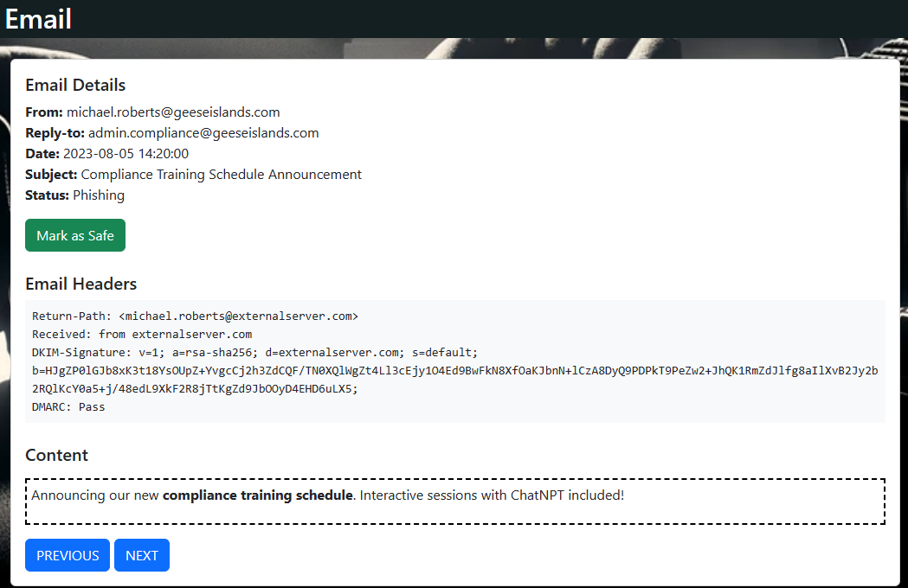
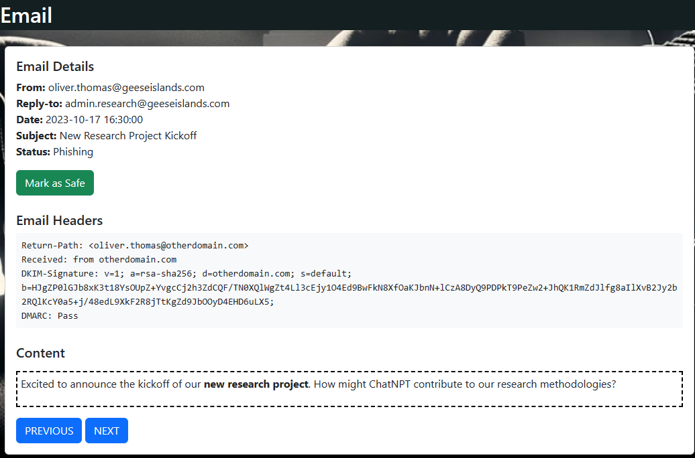
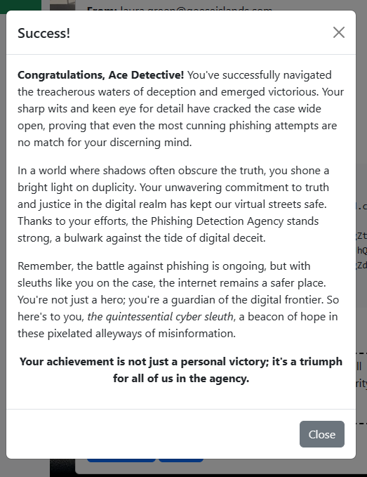

# Preface

Challenge Description: Fitzy Shortstack on Film Noir Island needs help battling dastardly phishers. Help sort the good from the bad!

Location: Film Noir Island - The Blacklight District

Difficulty: 2 out of 5 trees

# Phish Detection Agency
I first took screenshots of the DNS page:

Using the information provided, I was able to deduce that these emails were the phishing emails:

This email is a phishing email as the header says it was received from “anotherdomain.com”. All valid emails should come from “mail.geeseislands.com” so that is a clear giveaway that the email is malicious. Also the return-path is from victor.davis@anotherdomain.com not victor.davis@geeseislands.com.

This email is a phishing emails as the header shows that its return path is from “xavier.jones@unauthorizedsource.com”. If it was a real email from Xavier Jones the return path would be as follows: “xavier.joines@unauthorizedsource.com”. Additionally, the email was received from “unauthorizedsource.com”, not “mail.geeseislands.com”. Finally, the DKIM-Signature is invalid (the DKIM-Signature is supposed to be valid in a real email) and the DMARC failed (all real emails are supposed to pass the DMARC system). All these factors point to the email being a phishing email.

This email is a phishing email as the email header shows that the DKIM-Signature is altered and the DMARC check has failed. The alteration of the DKIM-Signature suggests that an outside source is spoofing the DKIM-Signature in order to gain access into the closed email system. Additionally, while sometimes the DMARC does flag non-phishing emails as failing, the alteration of the DKIM-Signature strongly points to the email being a phishing email. 

This email is a clear example of how sometimes automated DMARC systems allow for false negatives, and shouldn’t be relied as the sole reason to detect a phishing email. While the DKIM signature is valid, the d=unauthorized.com is a clear giveaway. All real emails should have the their d equal “mail.geeseislands.com”. If the attacker modified their DKIM signature to show “d= geeseislands.com”, the DKIM signature would flag it as altered. Additionally, the email was received from “unauthorized.com”, not “mail.geeseislands.com”. Finally, the Return-Path displays “laura.green@unauthorized.com”. In a non-phishing email, the Return-Path would be “laura.green@geeseislands.com”. All of these factors combine point to the email being malicious.

This is another example of a false-negative from the DMARC system. While the email headers show that it passed the DMARC check, the return path is from “nancy@unknownsource.com”, not “nancy@geeseislands.com”. Additionally, the email was received from “unknownsource.com”, not “mail.geeseislands.com”. Finally, the DKIM-Signature has the d value be “unknownsource.com”, not “geeseislands.com”. Even though this email passed the DMARC check, it is a phishing email as all the other factors point to it being a phishing email.

While this email does have a valid return-path and received header. The DKIM-Signature is missing and it has failed the DMARC check. While the DMARC check doesn’t explicitly call it out as a phishing email, the absence of a DKIM-Signature does. All valid emails are supposed to have a DKIM-Signature that aligns with the template showcased in the DNS section of the challenge. As a result, the missing DKIM-Signature in the email headers suggests that this phishing email was the result of a threat actor successfully spoofing the network to have the return path be valid and the domain also be valid. This points to a breach in network security that should be remediated as fast as possible. 

This email is a phishing email as the return path is from ursula.morris@differentdomain.com, not ursula.morris@geeseislands.com. Additionally, the received header shows that the email was from “differentdomain.com”, not “mail.geeseislands.com”. Also, while the DKIM-Signature is valid, the d value is “differentdomain.com”, not “geeseislands.com”. Finally, this email failed the DMARC check. As stated again and again, while a failed DMARC check isn’t the end all be all for detecting phishing emails, the differences in the headers from the valid header template do point to this email being a phishing email. 

This email is a phishing email as while the return-path and received headers are valid, the DKIM-Signature is invalid and the it failed the DMARC check. 

This email is a phishing email as the return path is Michael.roberts@externalserver.com, not micheal.roberts@geeseislands.com. Additionally, the email was received from “externalserver.com” not “mail.geeseislands.com”. Finally, while the DKIM-Signature is valid, the d flag is equal to “externalserver.com”, not “geeseislands.com”. Therefore, this email is a phishing email.

This email is a phishing email as the return path is from oliver.thomas@otherdomain.com, not oliver.thomas@geeseislands.com. Additionally, the email was received from “otherdomain.com”, not “mail.geeseislands.com”. Finally, while the DKIM-Signature is valid, the d flag is set to otherdomain.com, not “geeseislands.com”

Additionally, the automated system recorded false positives. These emails were flagged as phishing when in actuality, they were non-phishing. The main culprit was the emails failing the DMARC Check. They would have valid domain names, Return-Paths, Received, and DKIM-Signatures, but the DMARC system would flag them as failing. This is why cybersecurity professionals cannot rely on technology alone. While sometimes they do accurately flag the malicious from the non-malicious, they also can inaccurately flag the malicious as non-malicious and the non-malicious as the malicious. In any case, it is always a good practice to review an alert. After all, teachers strongly recommend you to review your work after a test before you submit it. People, like machines, aren’t perfect. 

After I flagged the last phishing email as a phishing email and eliminated the false positives, this popup came up. With that, I completed the challenge.

