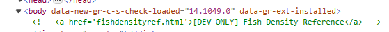

# Bonus! Fishing Guide
The first thing I did after I unlocked this challenge was to open up the Edge dev tools while sailing in the overworld. I then saw this in the elements tab:



The "[DEV ONLY] Fish Density Reference" looks interesting. Since it is an `href`, I can access it by typing in the console (with the window set to `sea`):

```txt
window.location.href = 'fishdensityref.html'
```
