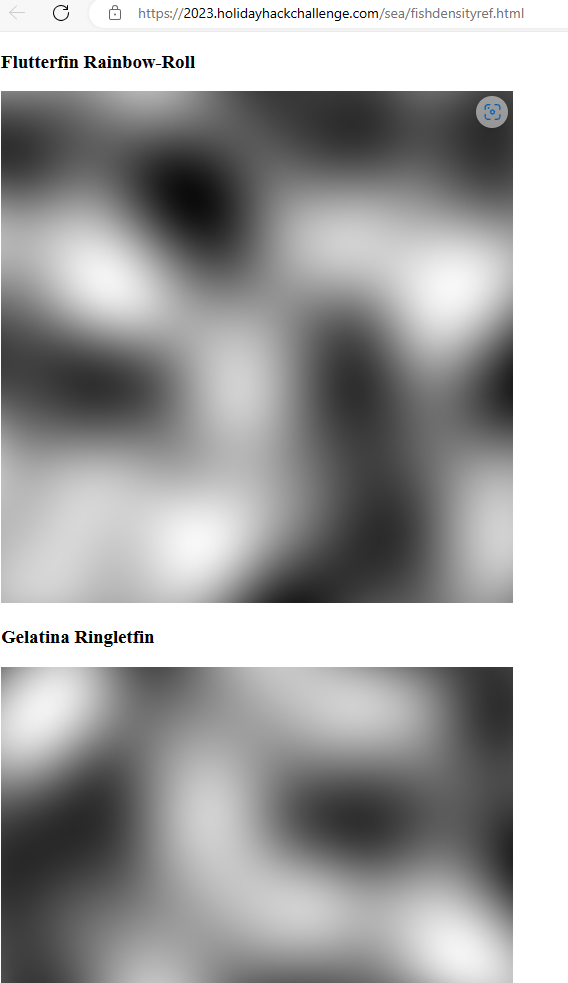

# Bonus! Fishing Guide
The first thing I did after I unlocked this challenge was to open up the Edge dev tools while sailing in the overworld. I then saw this in the elements tab:


The "[DEV ONLY] Fish Density Reference" looks interesting. Since it is an `href`, I can access it by typing in the console (with the window set to `sea`):

```txt
window.location.href = 'fishdensityref.html'
```

I then executed the command, which resulted in:



This page is a "heatmap" that shows the spawn points of all the 171 fish. Each fish has an entry, where the white parts show where the fish spawns, and the black parts show where the fish doesn't spawn. Looking at the heat map of each of the fish, I noticed a pattern: the vast majority spawn at the head of "Film Noir Island", shown here:


