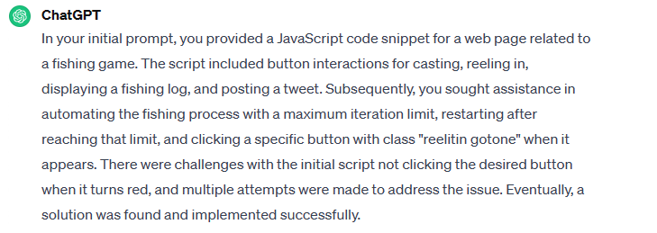
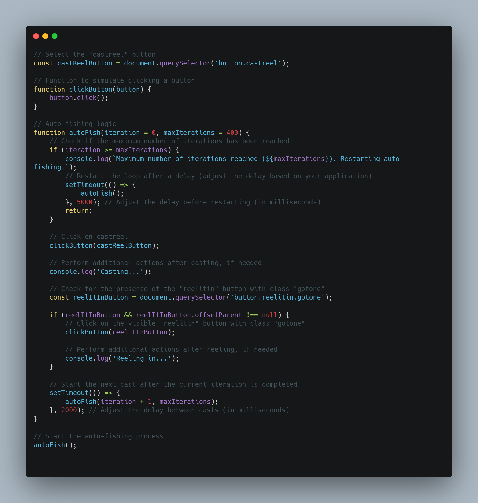
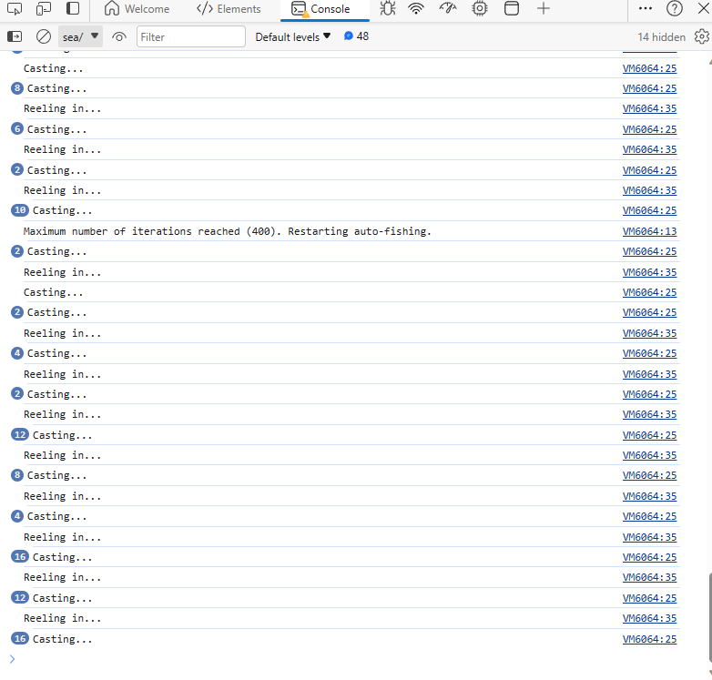
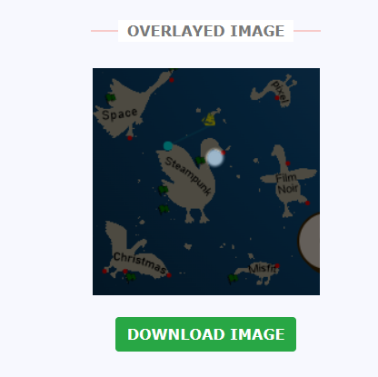
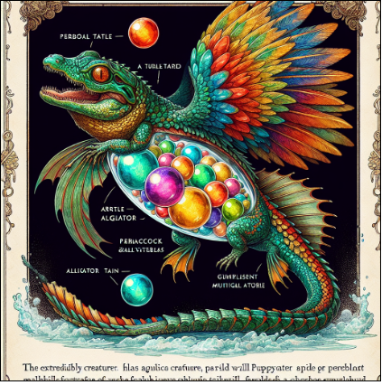
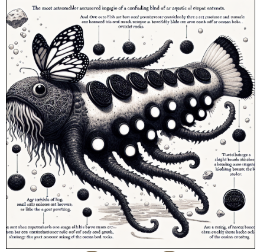
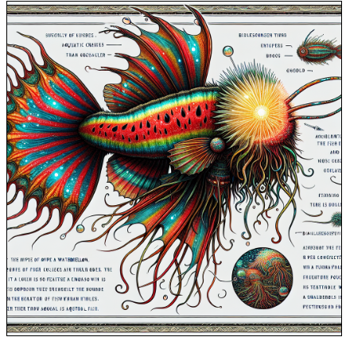
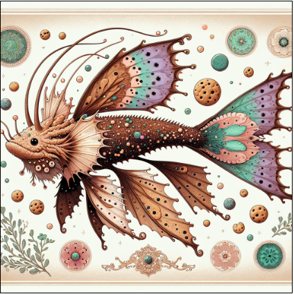
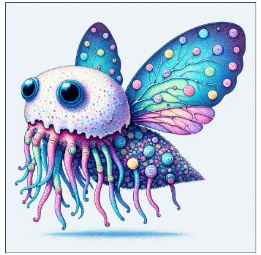

# Bonus! Fishing Mastery
Like in Pokemon, I now gotta catch them all (Nintendo please don't sue me)! Since there are 171 fish, it wouldn't be efficient for me to manually click the "cast" button and wait for "reel it in" button to turn red (indicating that a fish took the bait). Additonally, while fishing, the game is programmed to give duplicate catches. Therefore having to manually fish all 171 fish would take "only" 171 tries in the **best case** scenario. So, I went to my friend ChatGPT and gave them this prompt:

(I prompted ChatGPT to give a summary of all of my prompts, as it took around an hour of trial and error to actually get a working script). 

After "raging against the machine" for around an hour, I finally got a working script.

[Autofishing script](../scripts/fishing-mastery.js)

I then copied and pasted the script into the console (setting it to the window where the overworld is). I then executed the script, and sat back and relaxed. I let it run for a couple of hours, which I didn't mind as I went to a Christmas dinner at my uncle's house. Here is an example of the script in action:

When I got home I checked my computer to see that I only needed to catch one more fish. The only issue was that this fish was the Piscis Cybernectus Skodo, which only spawns in **one** teeny tiny spot on the map. So I downlaoded the heatmap for the Pisics Cybernectus Skodo and the minimap. I then went to `imageonline.com` to overlay the minimap with the heatmap, seen here:

I then went to the white spot on the minimap, and procceded to catch the Piscis Cybernectus Skodo in 10 minutes. I then went back to the elf that gave me the challenge, and upon talking to him, completed it. Here are some of my favorite fish that I caught:

My favorite. Yes all the fish were generated with AI how can you tell? I love the little alligator/iguana/winged/frog/snake "fish". It goes so hard.

Nightmare fuel - The fish

Kinda looks like those things from the Last of Us but with RGB gamer lighting (I say as I type from my Razer mechanical keyboard that is currently doing the rainbow effect). 

This one makes me feel happy. Like something from Candyland.

This one is the cutest. It looks like something I'd see at an amusement park gift shop. Or something that is very popular online to buy as a plush toy.
