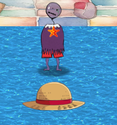
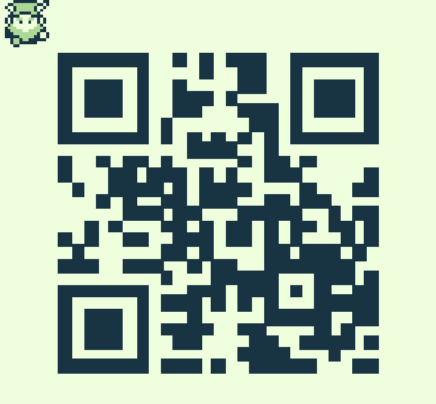

# Game Cartridges : Vol 1
After talking to the elf that tells of "buried" treasure, he gives you a "game cartridge detector". There are 3 game cartridges hidden throughout the islands. Unfortuantely I only completed Vol 1 and Vol 2 before the competition period ended. Anyway, the first game cartridge can be found here:

It is hidden under the luffy hat. Click the hat to find the cartridge. It will then be accessible from your inventory. You then play the game normally. There isn't any tricks to do. All you have to do is rearrange a couple of blocks in a messed up QR code to form a working (luckily it is only a couple as that would take forever if it was the entire code). However, you can only push the blocks, not pull. I recommend downloading the game by going in the network tab on the devtools and refreshing until the a file with the extension `.gb` comes up. Then you can use an online emulator (I prefer the emulator SameBoy but it isn't online) so you can use savestates to save your game while undergoing the task. Therefore if you make a mistake you can simply load your previous state. I also recommend rebinding the keys so that they are the same keys used for playing the game as if you were playing from the SANS Holiday Hack website, but whatever floats your boat. Anyway, once you push the last block into the right place, this screen comes up:

Everyone knows that scanning random QR codes is safe. So I scanned it from my phone, and got the flag

`santaconfusedgivingplanetsqrcode`

I then inputted it into the challenge box, and completed the challenge. 

Note- if that flag doesn't work try `flag:santaconfusedgivingplanetsqrcode`. 
