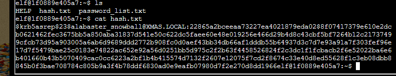
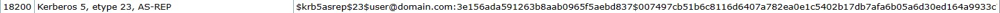
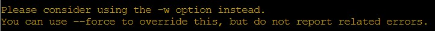
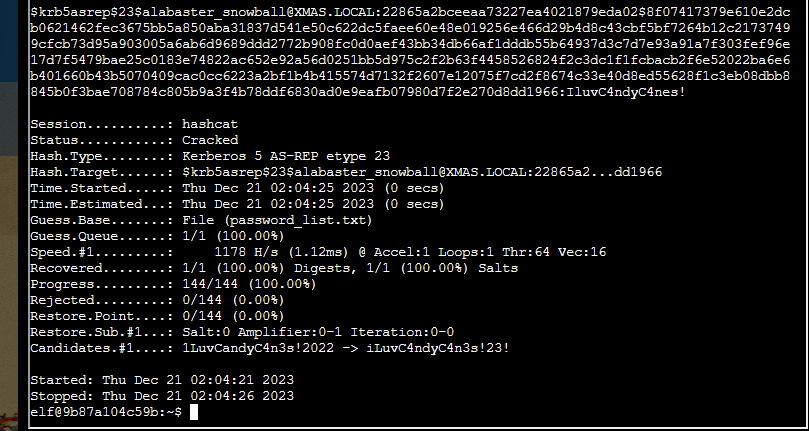

# Hashcat
When I ran the challenge, I am greeted with:
```txt
In a realm of bytes and digital cheer,  
The festive season brings a challenge near.  
Santa's code has twists that may enthrall,  
It's up to you to decode them all.

Hidden deep in the snow is a kerberos token,  
Its type and form, in whispers, spoken.  
From reindeers' leaps to the elfish toast,  
Might the secret be in an ASREP roast?

`hashcat`, your reindeer, so spry and true,  
Will leap through hashes, bringing answers to you.  
But heed this advice to temper your pace,  
`-w 1 -u 1 --kernel-accel 1 --kernel-loops 1`, just in case.

For within this quest, speed isn't the key,  
Patience and thought will set the answers free.  
So include these flags, let your command be slow,  
And watch as the right solutions begin to show.

For hints on the hash, when you feel quite adrift,  
This festive link, your spirits, will lift:  
https://hashcat.net/wiki/doku.php?id=example_hashes

And when in doubt of `hashcat`'s might,  
The CLI docs will guide you right:  
https://hashcat.net/wiki/doku.php?id=hashcat

Once you've cracked it, with joy and glee so raw,  
Run /bin/runtoanswer, without a flaw.  
Submit the password for Alabaster Snowball,  
Only then can you claim the prize, the best of all.

So light up your terminal, with commands so grand,  
Crack the code, with `hashcat` in hand!  
Merry Cracking to each, by the pixelated moon's light,  
May your hashes be merry, and your codes so right!

* Determine the hash type in hash.txt and perform a wordlist cracking attempt to find which password is correct and submit it to /bin/runtoanswer .*
```
I first use the `cat` command on the file `hash.txt` to see what the hash looked like. 



I then went to the Hashcat wiki's "example hashes" page and found this hash:



The example hash seems similar to the hash from `hash.txt`. From the startup message, tells me to add `-w 1 -u 1 --kernel-accel 1 --kernel-loops 1` to the end of my command, as since this is web-based emulated terminal that isn't using my computers native hardware to run hashcat (which I allocated the power to my Kali Linux VM), hash cat gives errors. So I ran the command:


```txt
hashcat -m 18200 hash.txt password_list.txt -w 1 -u 1 --kernel-accel 1 --kernel-loops 1 
```
The `-m` flag tells hashcat to that the hash corresponded with 18200 is the hash that it will be targeting. The `hash.txt` is the location of the hash to be cracked. The `password_list.txt` is the possible passwords for the hash. The `-w 1` sets the hashcat workload profile to be 1. The `-u 1` enables Enables uppercase rules, allowing the tool to test uppercase variations of the passwords. The `--kernel-accel 1` sets the kernel acceleration to be profile 1, which influences the speed of the cracking process. The `-kernel-loops 1 ` sets the number of kernel loops to be 1, as without the option hashcat is automatically killed due to using too much resouces on the web-based terminal. I run the command and get:



So I modify my command to be:

```txt
hashcat -m 18200 hash.txt password_list.txt -w 1 -u 1 --kernel-accel 1 --kernel-loops 1 --force
```

I then execute the modified command, and the result is:



Hashcat has cracked the hash! The password is `IluvC4ndyC4nes`. However, I need to execute `\bin\runtoanswer` in order to submit my answer in order to complete the challenge. So I type:

```txt


