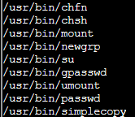

# Linux PrivESC:
Using the article provided by the hint *Linux Privilege Escalation Guide (Updated for 2023)* by Rashid-Ferose published by Payatu, I tried the strategies provided by the article. When I came across this:


It seemed interesting. In order to see if the Linux system I was working on had anything that could be used for a privilege escalation attack that also had a SUID bit set, I used this command:

```txt
find / -perm -u=s -type f 2>/dev/null
```

After I executed the command, the result was:




