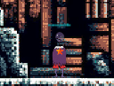
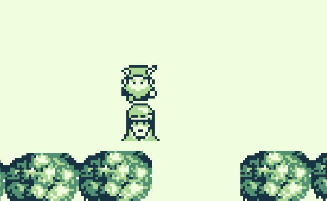
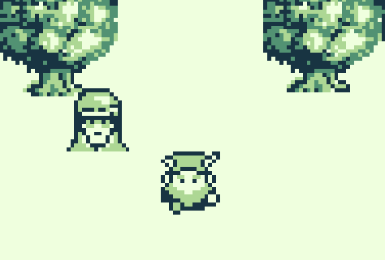
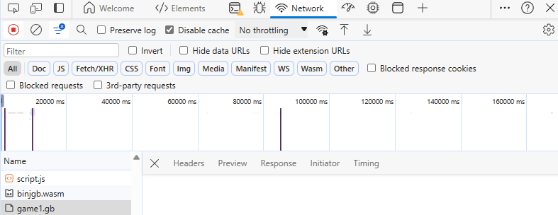
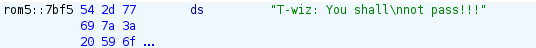
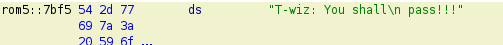
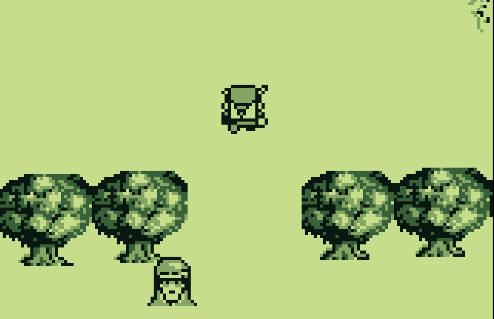
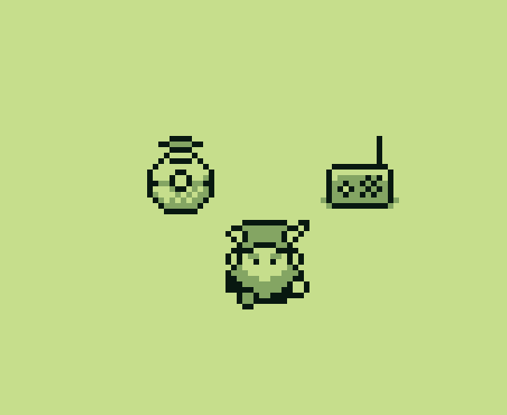
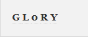

# Preface
Challenge Description: Find the second Gamegosling cartridge and beat the game

Location: Pixel Island - Driftbit Grotto

Difficulty: 3 out of 5 trees

# Game Cartridges: Vol 2
The second game cartridge game be found in Pixel Island, more specifically, Driftbit Grotto. In Driftbit Grotto, the location of the game cartridge is here:

Once you click where I am, the second game cartridge will be available for you to access in your inventory. I then started the game. I played through normally, but reached a roadblock where the character T-Wizz won't let you pass to the next area below hiim:

I then exited out of the game to see if anything changed if I played a new game. It did! While T-Wizz still won't let me pass, it is not to the area below. Instead, it is now in the area above:

Therefore there must be two versions of the game. So I went into dev tools and inspected the network tab to see if I could download each game version. On my first try, I was able to get:

I had one of the two versions of that game. However it took a couple of refreshes until:

Got it. I then hopped onto my Kali Linux VM and installed the GhidraBoy plugin to enable Ghidra to reverse engineer the game boy roms. I then used to Ghidra to analyze `game0.gb`. While looking at the output, I found something that caught my attention:

This is the code for the text that appears in game0 when you attempt to cross T-Wiz. Since it was "You shall not pass!!!", I wondered what would happen if I changed it to 

I then saved the modified code as `game0mod.gb`, and proceeded to run it in `SameBoy`. Would this simple modification work?

It actually worked. I was actually surprised. I believe that the reason why I could pass him is because when I changed the test in the game from "You shall not pass!!!" to "You shall pass!!!" it somehow broke his code so that he wouldn't display his text. When he displayed the text the game would force me to walk back. Now that the text isn't being displayed anymore, I now am able to access the next area. In the next area there was a building that I could access. I went there and inside of it was a radio and a robot named "ChatNPT"

The radio played a noise that was **very** similar to morse code. So I used Sameboy's record feature to record the noise. I then edited it in ClipChamp so only the part where the morse code was playing would be in recording. By using ClipChamp I made my recording a video, so I had to convert it into in audio format. I chose the MP3 audio format as it is widely used. I then converted the video to an mp3 file using the website `FreeConvert` and clicking on the link that said `MP4 to MP3 converter`. I then uploaded my modified MP4 file and then once that was converted to an MP3, downloaded it. I then went to the website `morsecode.world` that had a morse code decoder which would decode morse code from an audio file. I then uploaded my file and started the process. When the decoder finished decoding, the result was:

Which is `GL0RY`.

I then went to the challenge in my `Objectives` tab and entered `GL0RY` as my answer, which was correct!

