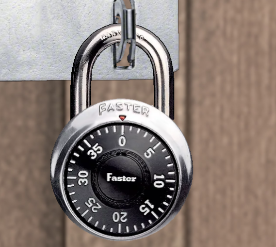
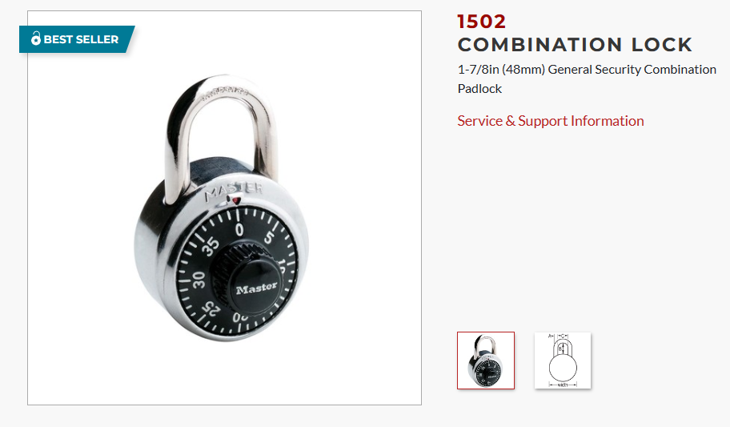
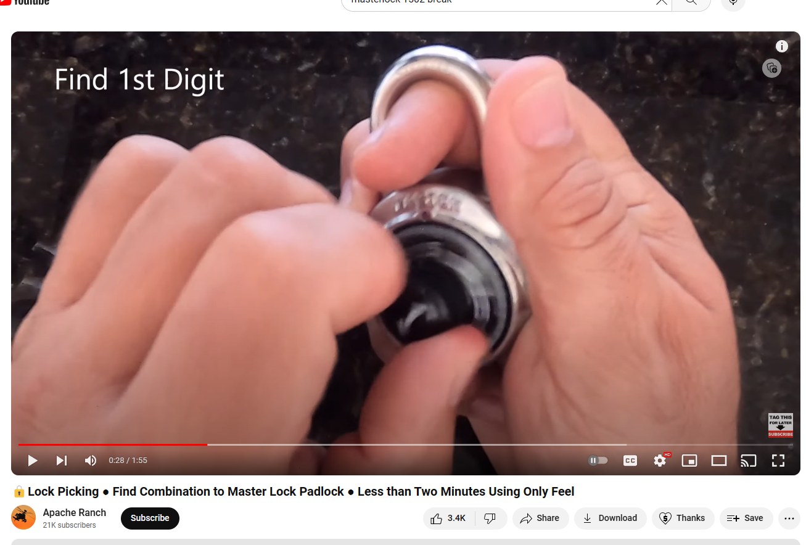
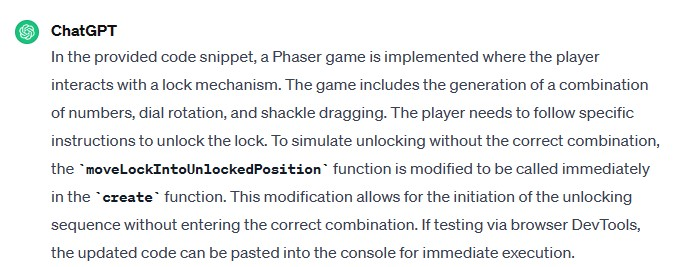
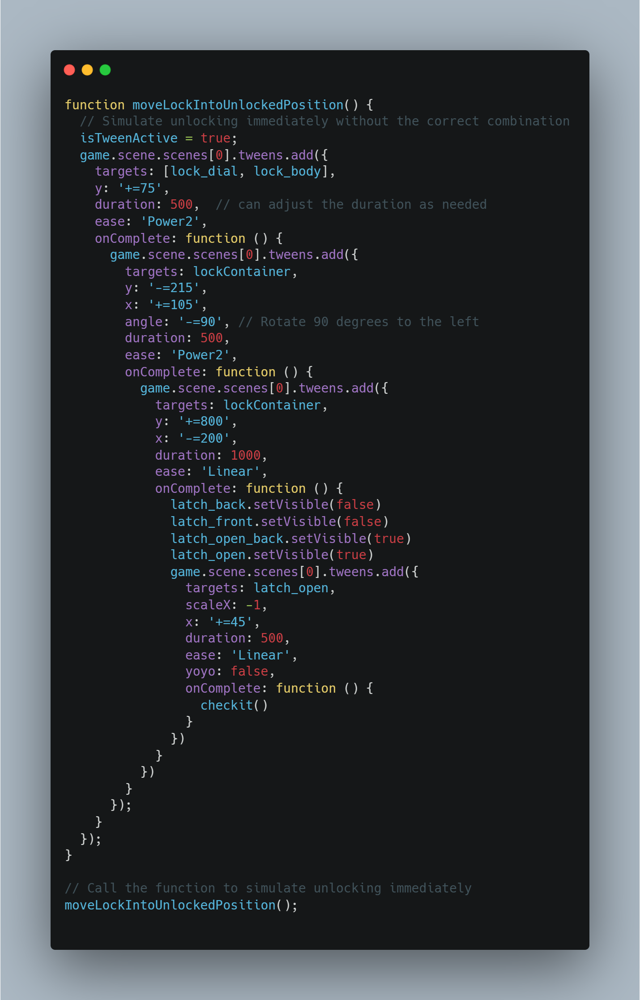
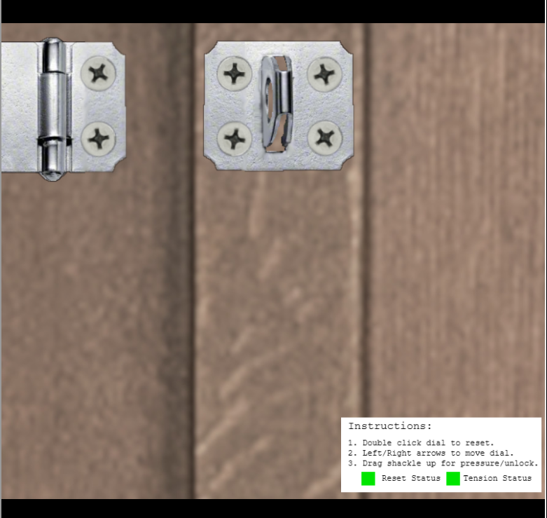

# Faster Lock Combination
When I started the challenge, I noticed that the "Faster Lock"

Looked exactly like the lock that was used in my high school but with the words "Faster" instead of "Master". So I did a little digging and found the master lock for sale on a website:

Which tells me the name of the MasterLock was Masterlock 1502. I then searched youtube to see if I could find a video that showcased how to find the combination in a MasterLock 1502. 

I watched the video. The video tells the viewer that in order to find the combination for the MasterLock 1502, simply put your finger through the loop and rotate the knob clockwise. Stop when you feel tension. Then add 5 to the digit you stopped on. That will be the first number of your combination. Then repeat the process again but this time turn the knob counter clockwise. When you feel tension stop. The digit you stopped on is the second number in your combination. Finally, rotate clockwise and while doing so pull on the top of the lock like you were trying to unlock it. Eventually the lock should unlock at a digit. That digit is the third number in the combination. So I tried this method, but to no avail. As this was a software replica of the MasterLock 1502, the tension was coded in. However, it was hard for me to unlock, mainly because I couldn't physically hold the lock like in the video. So I went into the dev tools and expected the scripts used by the challenge. I then found the function which decided if the lock would unlock or not. I copied and pasted the function into ChatGPT, which I then prompted to write a script that would immediately unlock the lock:

ChatGPT then wrote a script:

[Unlock Script](../scripts/faster-lock.js)

I then set the console to be in the window where the Faster-Lock-Combination challenge was operating, and then copied and pasted the script. I then executed the script, which:

Immediately unlocked the lock for me. With that, I completed the challenge.

