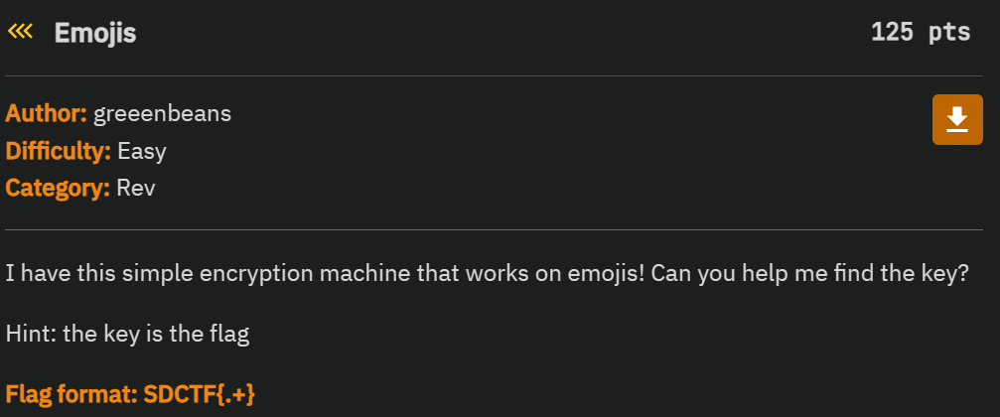

# Emojis


The challenge gives us a python file, which contains
```txt
def main():
    print("what do you think the key is?")
    encrypted = '🙚🙒🙌🙭😌🙧🙬🙻🙠🙓😣🙯🙖🙺🙠🙖😡🙃🙭🙿🙩🙟😯🙮🙬🙸🙻🙦😨🙩🙽🙉🙻🙑😯🙥🙻🙳🙐🙓😿🙯🙽🙉🙣🙐😡🙹🙖🙤🙪🙞😿🙰🙨🙤🙐🙕😯🙨🙽🙳🙽🙊😷'
    key = input()
    plaintext = ''.join([chr(ord(c) ^ ord(key[i % len(key)])) for i, c in enumerate(encrypted)])
    print("your decrypted text:", plaintext)
```

When we run the program, it asks us for a key, and then outputs a message that uses emojis. Therefore in order to solve this challenge we must reverse engineer the code so that we are able to obtain the flag from the encrypted message. Using chatgpt, I was able to create a script that added a decryption function that took a partial key and then asked for the encrypted emoji text generated by that key. Then the program would decrypt the encrypted text using the partial key to find the flag. The challenge text hints that the encryption key starts with 
```txt
SDCTF{
```
So I entered `SDCTF` into the orginal python file without the decryption function, which resulted in:

```txt


