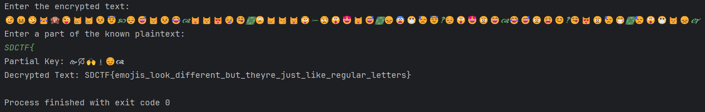

# Emojis


The challenge gives us a python file, which contains
```txt
def main():
    print("what do you think the key is?")
    encrypted = '🙚🙒🙌🙭😌🙧🙬🙻🙠🙓😣🙯🙖🙺🙠🙖😡🙃🙭🙿🙩🙟😯🙮🙬🙸🙻🙦😨🙩🙽🙉🙻🙑😯🙥🙻🙳🙐🙓😿🙯🙽🙉🙣🙐😡🙹🙖🙤🙪🙞😿🙰🙨🙤🙐🙕😯🙨🙽🙳🙽🙊😷'
    key = input()
    plaintext = ''.join([chr(ord(c) ^ ord(key[i % len(key)])) for i, c in enumerate(encrypted)])
    print("your decrypted text:", plaintext)
```

When we run the program, it asks us for a key, and then outputs a message that uses emojis. Therefore in order to solve this challenge we must reverse engineer the code so that we are able to obtain the flag from the encrypted message. Using chatgpt, I was able to create a script that added a decryption function that took a partial key and then asked for the encrypted emoji text generated by that key:
```txt
def decrypt_with_partial_key(encrypted, partial_key):
    decrypted = ''.join([chr(ord(c) ^ ord(partial_key[i % len(partial_key)])) for i, c in enumerate(encrypted)])
    return decrypted

def main():
    print("Enter the encrypted text:")
    encrypted = input().strip()
    
    print("Enter a part of the known plaintext:")
    known_part = input().strip()
    
    # Use known part to extract part of the key
    partial_key = ''.join([chr(ord(encrypted[i]) ^ ord(known_part[i])) for i in range(len(known_part))])
    
    # Decrypt the text using the partial key
    decrypted_text = decrypt_with_partial_key(encrypted, partial_key)
    
    print("Partial Key:", partial_key)
    print("Decrypted Text:", decrypted_text)

if __name__ == "__main__":
    main()
```
. Then the program would decrypt the encrypted text using the partial key to find the flag. The challenge text hints that the encryption key starts with 
```txt
SDCTF{
```
So I entered `SDCTF` into the orginal python file without the decryption function, which resulted in:

```txt
what do you think the key is?
SDCTF{
your decrypted text: 😉😖😏😹🙊😜😿😿😣😇🙥😔😅😾😣😂🙧😸😾😻😪😋🙩😕😿😼😸😲🙮😒😮😍😸😅🙩😞😨😷😓😇🙹😔😮😍😠😄🙧😂😅😠😩😊🙹😋😻😠😓😁🙩😓😮😷😾😞🙱


** Process exited - Return Code: 0 **
Press Enter to exit terminal
```
I then copied and pasted the decrypted text, and entered it into the reversed engineered code, which resulted in:



Therefore the flag is:

```txt
SDCTF{emojis_look_different_but_theyre_just_like_regular_letters}
```
I then entered the flag into the challenge box and solved the challenge.

