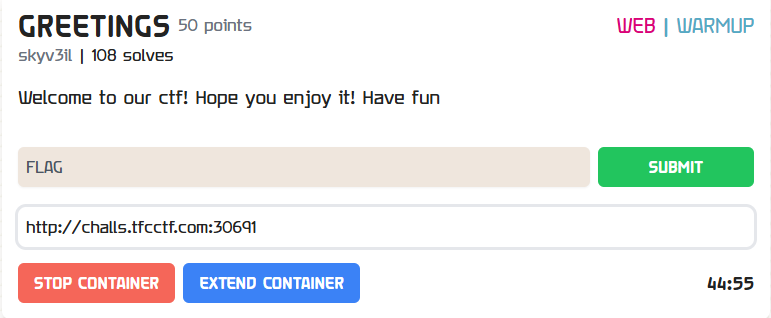
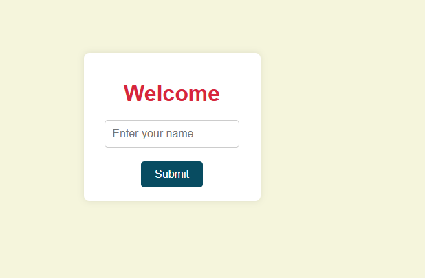
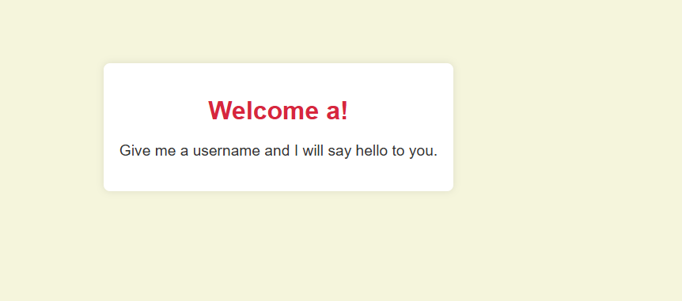
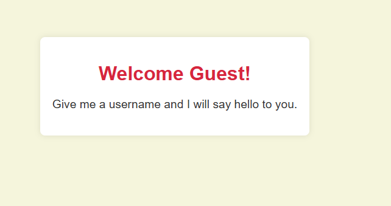
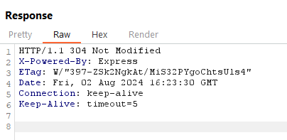
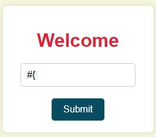
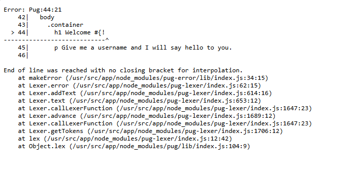

# GREETINGS



I start the instance, and click on the link generated by the instance, which takes me to this website:



I try to enter nothing, but I get a popup that tells me to enter something, so I enter my name as "a", which results in:



I then look at the URL at the top of the page:

```txt
http://challs.tfcctf.com:30691/result?username=a
```

I wondered what would happen if I deleted the `?username` filed from the URL, so, I changed the URL to:

```txt
http://challs.tfcctf.com:30691/result
```

Which resulted in:



Interesting, as I wasn’t allowed to leave the username field blank in the welcome screen. Anyway, I open BurpSuite, and while analyzing the requests, I notice in one of the respones:



Express is written in Javascript, therefore to exploit any vulnerability present on the website, I must use Javascript exploits. I began by attempting a Javascript SSTI attack, entering:



If the website gives me an error after executing this, it is vulnerable to SSTI, as if it wasn't vulnerable to SSTI, it wouldn't give an error. I then execute my input, which results in:



The website is vulnerable. Looking at the text of the error:

```txt
Syntax Error: Unexpected token
    at makeError (/usr/src/app/node_modules/pug-error/lib/index.js:34:15)
    at Lexer.error (/usr/src/app/node_modules/pug-lexer/index.js:62:15)
    at Lexer.assertExpression (/usr/src/app/node_modules/pug-lexer/index.js:96:12)
    at Lexer.addText (/usr/src/app/node_modules/pug-lexer/index.js:627:12)
    at Lexer.text (/usr/src/app/node_modules/pug-lexer/index.js:653:12)
    at Lexer.callLexerFunction (/usr/src/app/node_modules/pug-lexer/index.js:1647:23)
    at Lexer.advance (/usr/src/app/node_modules/pug-lexer/index.js:1689:12)
    at Lexer.callLexerFunction (/usr/src/app/node_modules/pug-lexer/index.js:1647:23)
    at Lexer.getTokens (/usr/src/app/node_modules/pug-lexer/index.js:1706:12)
    at lex (/usr/src/app/node_modules/pug-lexer/index.js:12:42)
```

The website seems to be stored in the `/usr/src/app/` directory of the server. I then type:

```txt


