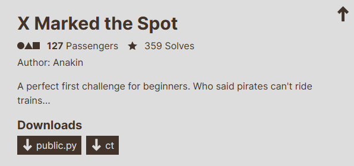
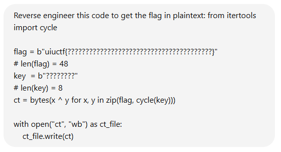
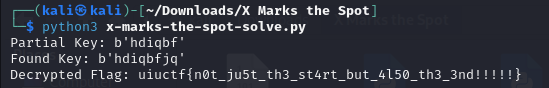

# X Marked the Spot



I downloaded `public.py` and `ct` onto my Kali Linux VM. `ct` contained:

```txt
X6.
   Z.^;
       9^]T6
U5BHPCGK
```

While `public.py` contained:

```txt
from itertools import cycle

flag = b"uiuctf{????????????????????????????????????????}"
# len(flag) = 48
key  = b"????????"
# len(key) = 8
ct = bytes(x ^ y for x, y in zip(flag, cycle(key)))

with open("ct", "wb") as ct_file:
    ct_file.write(ct)
```

I then crafted a Chat-GPT prompt:



Which resulted in this script:

```txt
from itertools import cycle
import string

# Read the ciphertext from the file
with open("ct", "rb") as ct_file:
    ct = ct_file.read()

# Known part of the plaintext (uiuctf{})
known_plaintext = b"uiuctf{"

# XOR the first 6 bytes of the ciphertext with the known plaintext to deduce the partial key
partial_key = bytes(ct[i] ^ known_plaintext[i] for i in range(6))

# Print the partial key to analyze further
print(f"Partial Key: {partial_key}")

# We need to brute-force the remaining 2 bytes of the key
for c1 in string.printable.encode():
    for c2 in string.printable.encode():
        potential_key = partial_key + bytes([c1, c2])

        # Decrypt the ciphertext using the potential key
        decrypted_flag = bytes(x ^ y for x, y in zip(ct, cycle(potential_key)))

        # Check if the decrypted flag starts with the known plaintext and ends with '}'
        if decrypted_flag.startswith(known_plaintext) and decrypted_flag.endswith(b'}'):
            print(f"Found Key: {potential_key}")
            print(f"Decrypted Flag: {decrypted_flag.decode()}")


print("Key not found. Try adjusting the approach or assumptions.")
```

Which I copied and pasted into a python file I had named `solve.py`. I then ran `solve.py`:



I then submitted `uiuctf{n0t_ju5t_th3_st4rt_but_4l50_th3_3nd!!!!!}` and solved the challenge.
