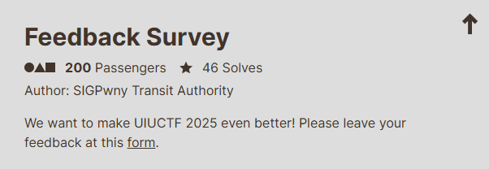
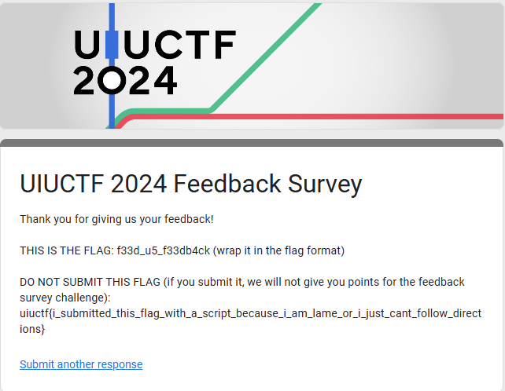

# Feedback Survey

I went to the link and filled out the survey. Once I completed the survey, I was greeted with:

I found it interesting that the challenge organizers made a flag to catch people botting. Since I am not a bot, I submitted `uiuctf{f33d_u5_f33db4ck}` and solved the challenge. 
