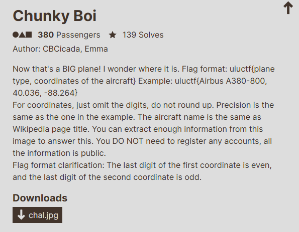
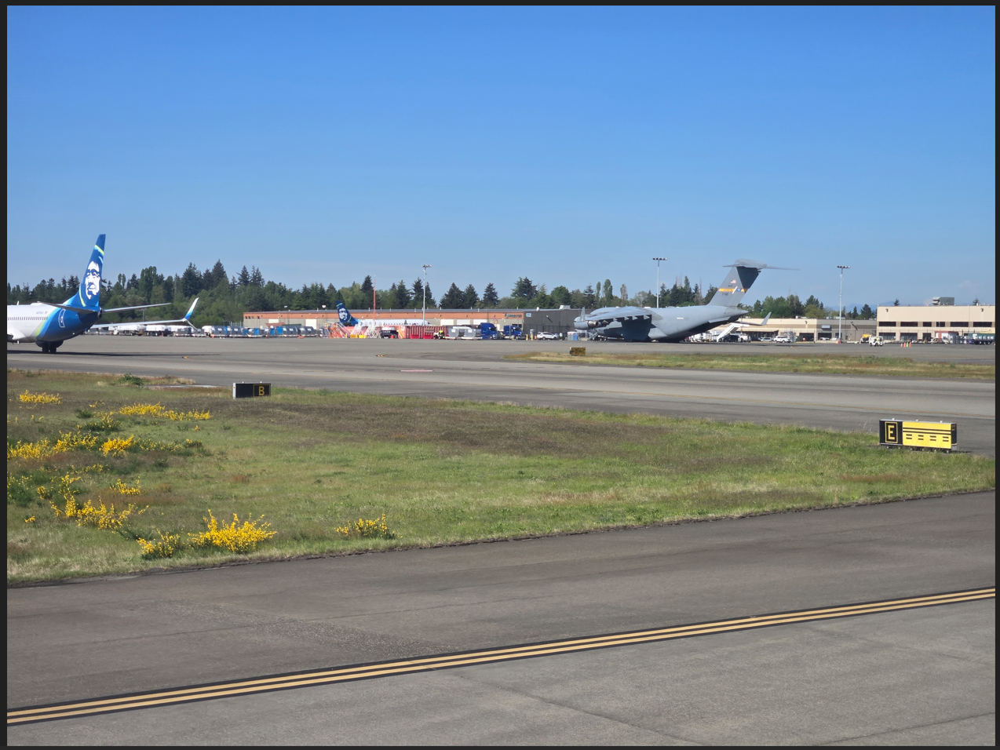
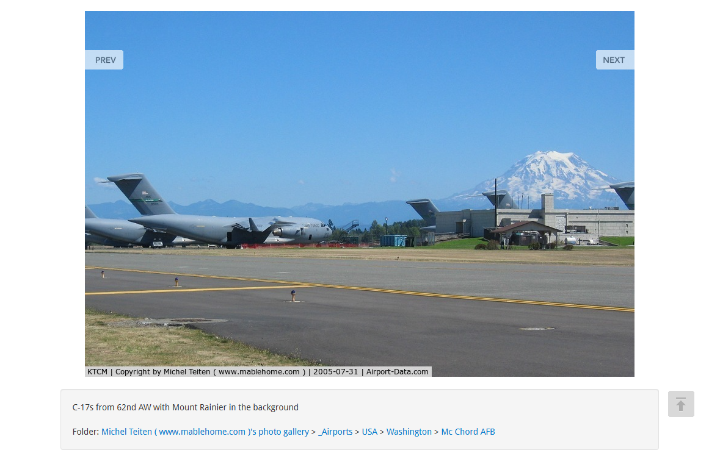
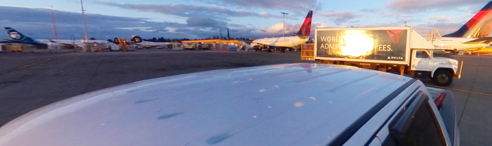
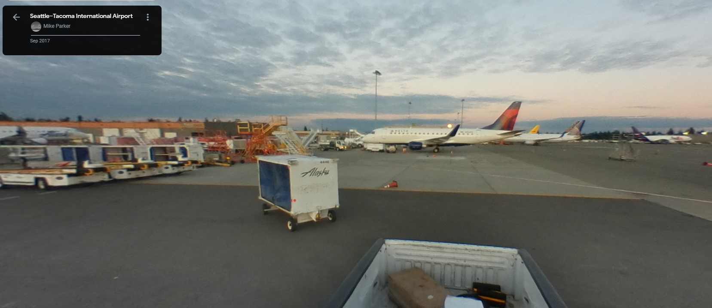
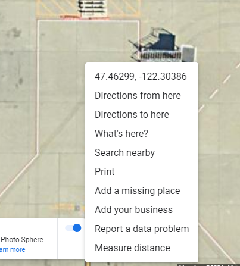

# Chunky Boi

I downloaded `chall.jpg` and opened it using my computer's image viewer:

I immediately recognized the airport as the Seattle-Tacoma International Airport due to a previous OSINT challenge in the National Cyber League Fall 2023 Team Competition, where my team had to find an airport terminal from an image. Since I spent hours on that challenge with my team, I had the memory of the Seattle-Tacoma International Airport burned in my mind (I spent a considerable amount of time looking through the entire airport layout to find the terminal). Since I already knew the airport, I only had to find the model of the plane. I used Google's reverse image search, which eventually led me to this website:

 

I then searched `C17 plane` on Google, which returned `Boeing C-17 Globemaster III`. Now knowing the plane and the airport, I only had to find the coordinates of the plane. So I went to Google Earth and started "walking" through the runway:

After some time, I eventually came across:

That plane seems to be in the same location as the Chunky Boi, so I then exited out of street view and went to map view. I then attempted to pin down the coordinates of the plane in the image, using the challenge hint of "the last digit in the first coordinate is even, the last digit in the second coordinate is odd":

The third digit in the first coordinate was even, and the last digit in the second coordinate was odd, so I then crafted:

`uiuctf{Boeing C-17 Globemaster III, 47.462, -122.303}`

I then submitted `uiuctf{Boeing C-17 Globemaster III, 47.462, -122.303}` and solved the challenge.

