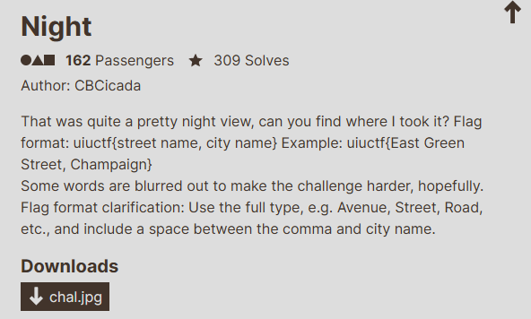
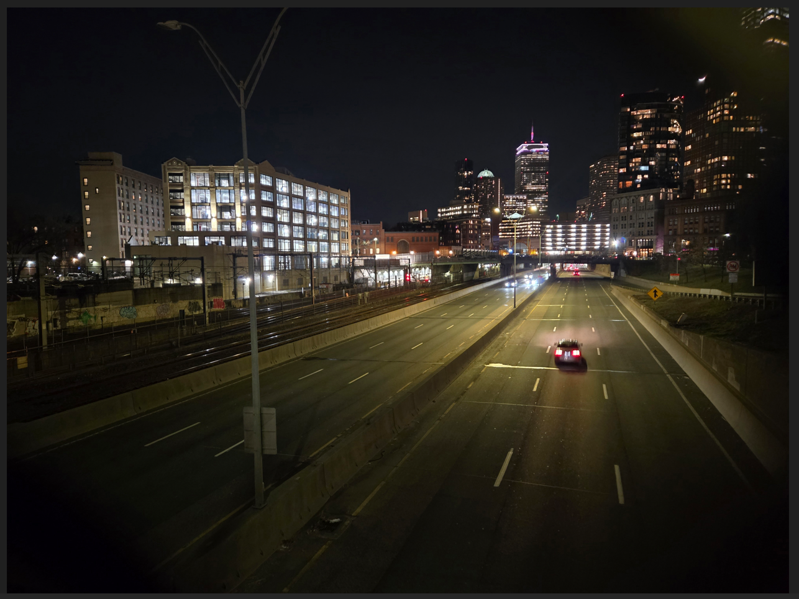
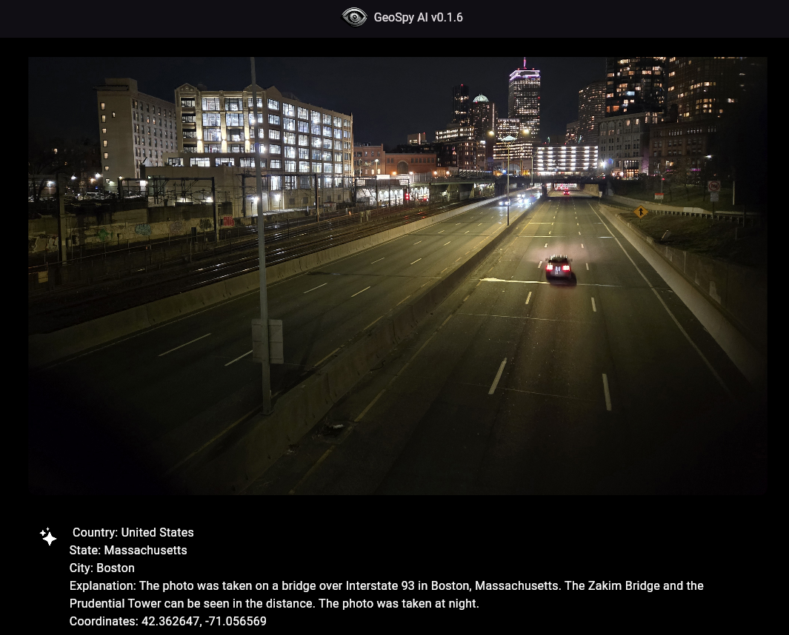
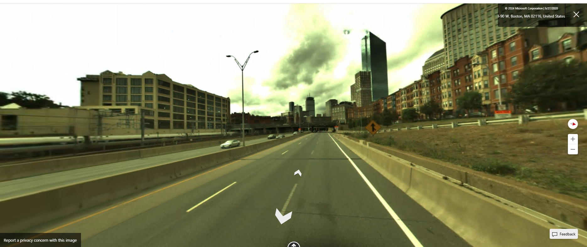
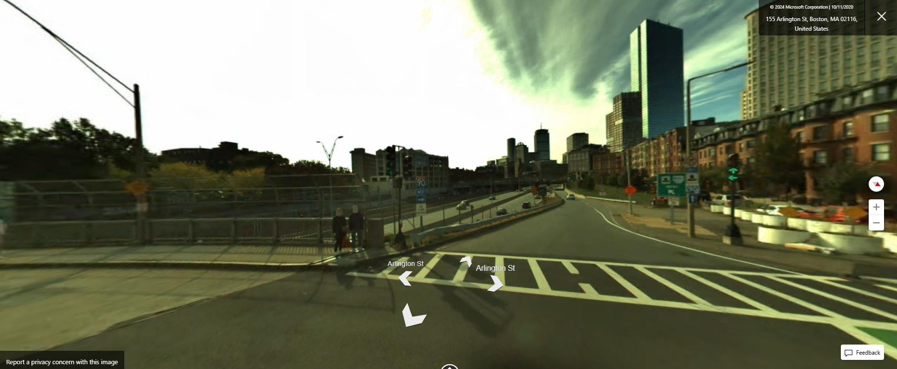

# Night

I downloaded `chal.jpg` onto my computer, and opened it with my computer's image viewer:

With any location-based OSINT challenge, I like to use `GeoSpy.ai`. It's a great way to get an idea of where to look. So, I inputted `chal.jpg` into GeoSpy.ai:

I then searched `Prudential Tower` on Bing Maps. Once I found where the tower was located, I turned on StreetView, and began "walking" away from the tower:

I then "walked" around until I could recreate the angle of the image:

The street I was currently on was `Arlington Street`, and I was in the city of `Boston`. Using the challenge description, I then submitted `uiuctf{Arlington Street, Boston}` and solved the challenge.
