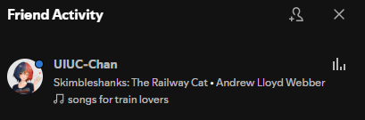

# The Weakest Link

Going back to UIUC-Chan's Linkedin profile, I navigated to the description:

I wonder if their spotify is on their Linkedin, so I looked at their contact info:

Nice! I then navigate to UIUC-Chan's Spotify page:

Here is their playist:

I then was stumped for several hours. I searched Spotify relentlessly. But I couldn't find the "secret collab". Eventually, I wondered if the Spotify desktop app was different from the website, so I downloaded the app onto my computer. I then followed UIUC Chan from there, which prompted a notification in my friend activity:

I then clicked on the linked playlist:

I couldn't believe my eyes. After all the time spent searching, the flag was in plain sight all this time. I then submitted `uiuctf{7rU1Y_50N65_0F_7H3_5UMM3r_432013}` and solved the challenge.

