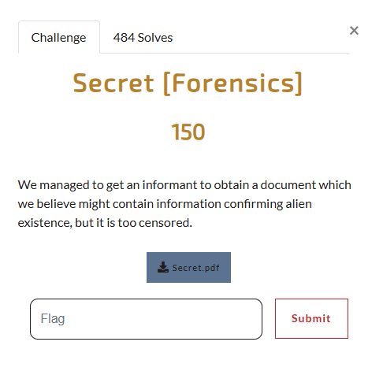
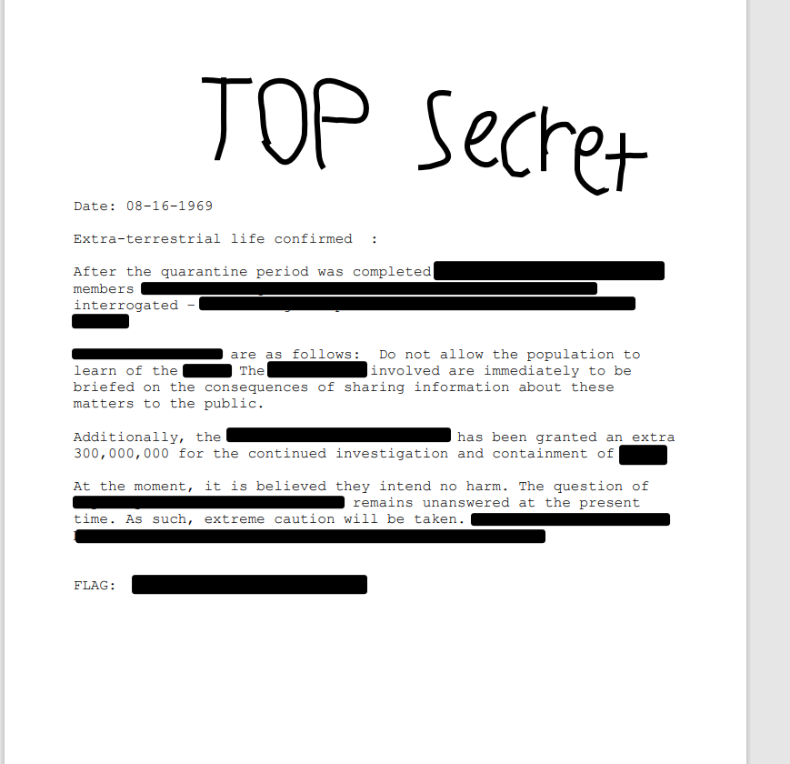
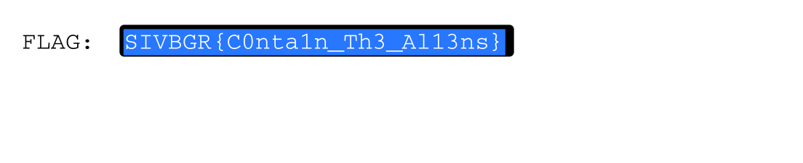

# Secret  

  

I download `secret.pdf` and open it using my Kali Linux VM's PDF viewer: 

 

Seems like it is redacted. However, it seems like someone may have just put black bars on top of the document, as I can see some traces of text coming out of the black bars. So, I highlight the black bar next to `FLAG:`: 

 

I then submit `SIVBGR{C0nta1n_Th3_Al13ns}` as the flag and solve the challenge. 
