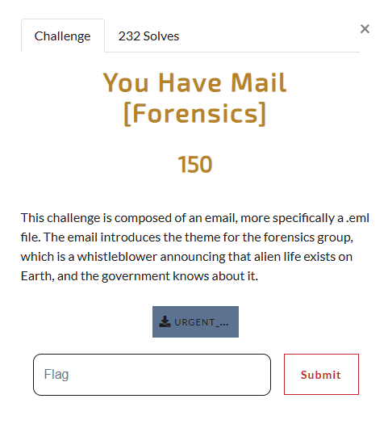
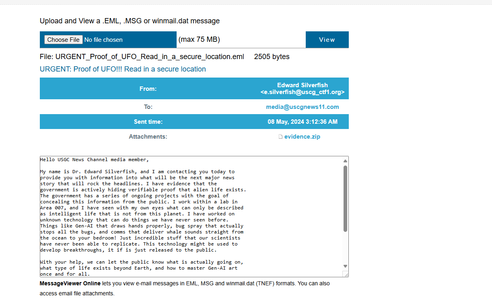
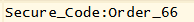
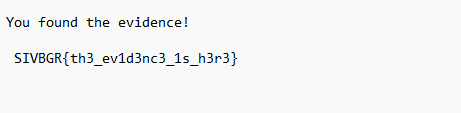

# You Have Mail


I download the file, which is a `.eml` file. I then open the file using `encryptomatic.com`'s online .eml file viewer:



Here is the full text:

```txt
Hello USGC News Channel media member,

My name is Dr. Edward Silverfish, and I am contacting you today to
provide you with information into what will be the next major news
story that will rock the headlines. I have evidence that the
government is actively hiding verifiable proof that alien life exists.
The government has a series of ongoing projects with the goal of
concealing this information from the public. I work within a lab in
Area 007, and I have seen with my own eyes what can only be described
as intelligent life that is not from this planet. I have worked on
unknown technology that can do things we have never seen before.
Things like Gen-AI that draws hands properly, bug spray that actually
stops all the bugs, and comms that deliver whale sounds straight from
the ocean to your bedroom! Just incredible stuff that our scientists
have never been able to replicate. This technology might be used to
develop breakthroughs, it if is just released to the public.

With your help, we can let the public know what is actually going on,
what type of life exists beyond Earth, and how to master Gen-AI art
once and for all.

Please see the attachment for my first piece of evidence. I am not
very good at understanding encryption details, but I did password
protect the file. The password is 53 65 63 75 72 65 5f 43 6f 64 65 3a
4f 72 64 65 72 5f 36 36.

Utilize a common number system to decrypt that password.
```
There is an `evidence.zip` file which I can download, so I download it. I open it up, and see that it contains a file called `evidence.txt`. However, when I try to open `evidence.txt`, I am prompted for a password. The email has the password for the file, however I must use a common number system to decrypt the password. So I copy and paste:

`53 65 63 75 72 65 5f 43 6f 64 65 3a 4f 72 64 65 72 5f 36 36`

Into `dcode.fr`'s cipher identifier, which identifies the text to be ASCII encoded. So I use `dcode.fr`'s ASCII decoder, which results in:



I then attempt to open `evidence.txt` again, and when it asks for a password, I enter `Secure_Code:Order_66`, which unlocks the file, revealing:



I then submit `SIVBGR{th3_ev1d3nc3_1s_h3r3}` and solve the challenge.
