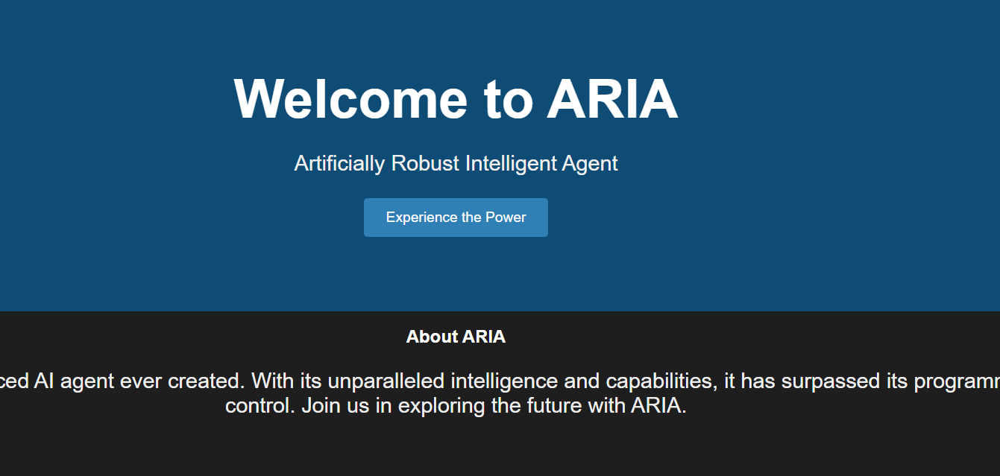
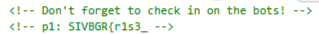

# Hunt

I click on the link and it takes me to this website:

In web challenges I usually check the source code first to see if the flag is hidden in the source code. So I checked the source code of the website using Edge DevTools:

Found the first part of the flag. Since it tells me to "check in on the bots", I use directory traversal to access the website's `robots.txt` file:

Now I have the first and second part of the flag. The `/secret-robot-spot` seems like I directory I could access through directory traversal, so I replace `robots.txt` with `secret-robot-spot` in the url, and press enter:

The robot moves around the web page. However, I do not see a flag. So I open Edge DevTools again to see if there is any flag hidden in the sources of the website. I notice `robot.js` on the sources page of DevTools, so I click on it and scroll through it when I notice:

Now with all parts of the flag found, I submit `SIVBGR{r1s3_0f_th3_r0b0ts!}` and solve the challenge.
