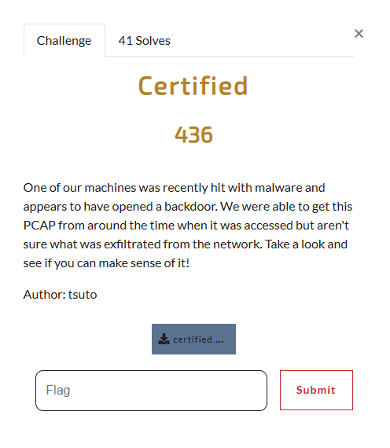
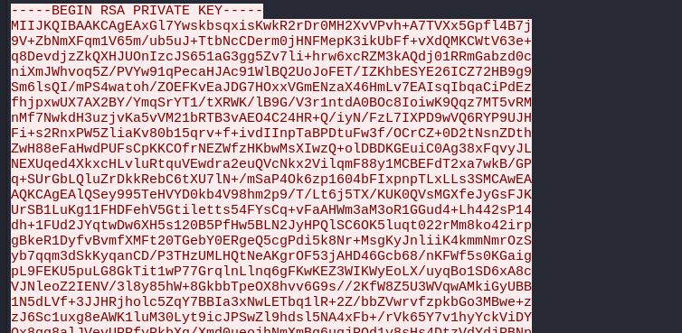
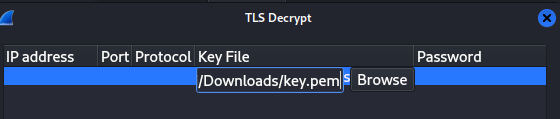

# Certified

I downloaded the included pcap file and opened it up in wireshark for analysis. Most of the packets were TLS encrypted, so it was gibberish. However, some weren't. While scrolling through the `tcp flow`, I noticed this in packet 6:

Know that I know the RSA private key, I can decrypt the TLS encrypted packets. I extracted the RSA private key and made it a `.pem` file, which I then imported as one of my RSA keys in Wireshark.

