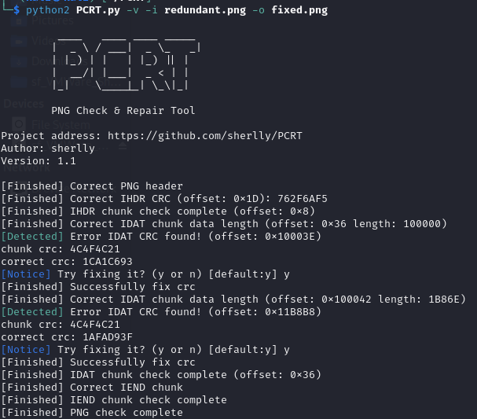

# Redundant

I downloaded the file and opened it using the image viewer in my Kali Linux VM:

Yep thats a corrupted file. I then ran `PCRT` to see if it would be able to restore the image to it's uncorrupted state:

Since the operation was successful, I opened `fixed.png`, which displayed:

I then submitted `SIVUSCG{1nv4l1d_chunk5_l0l}` and solved the challenge.
