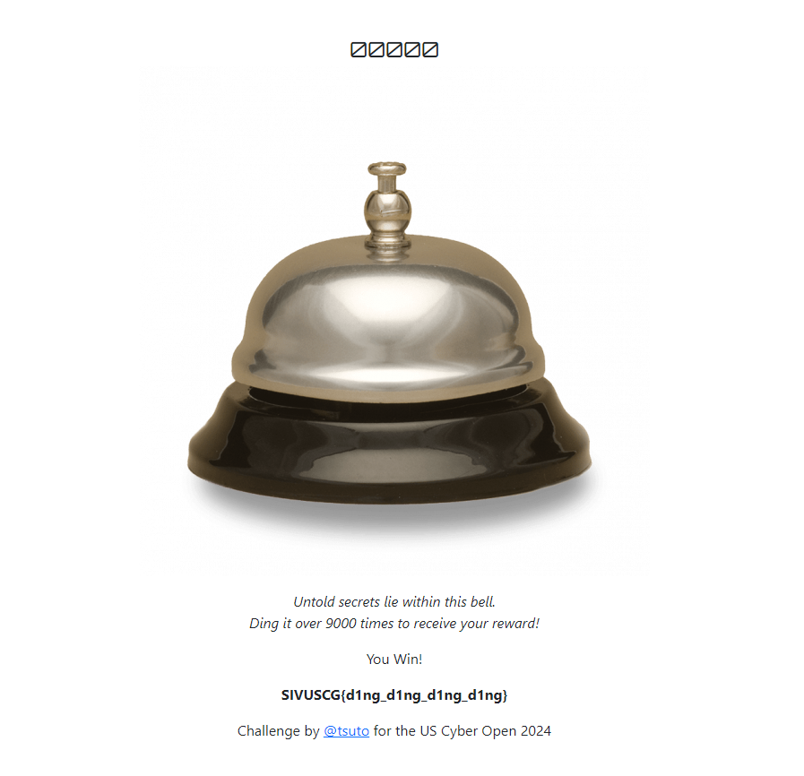

# Ding O Tron


I click on the link, which directs me to this website:


It seems like I will have to ding this bell over 9000 times. I am not doing that. There has to be a shortcut, so I look at the webpage's source code using Chrome DevTools where I notice:


Since the `giveFlag()` is commented out in the response, dinging the bell over 9000 times wouldn’t do anything. Just for fun I typed 

```txt
giveFlag()
```

in the console, which resulted in:


So I spent an hour or so combing through the pages source code, the network tab, the application storage, basically everything in DevTools. But I couldn't find the supposed secret function. In a hail mairy, I typed 

```txt
secret
```
in the console, where I saw:


in the function list. `superSecretFunction_32bbe8695623c88e` must be the "secret function" I was looking for (unless it was a red herring). At that point, with all of my options exhausted, I executed:

```txt
superSecretFunction_32bbe8695623c88e
```

in the console, which resulted in:


The page itself displayed:



I then submitted `SIVUSCG{d1ng_d1ng_d1ng_d1ng}` and solved the challenge.


