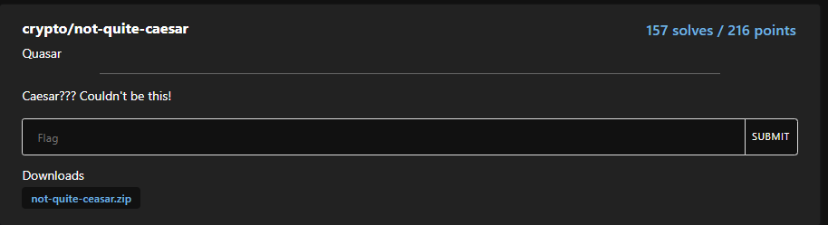
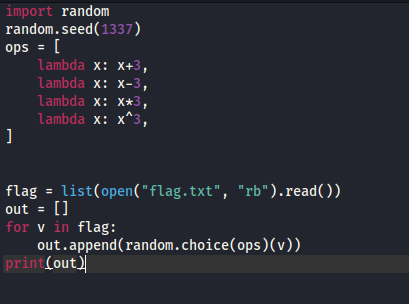
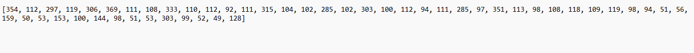
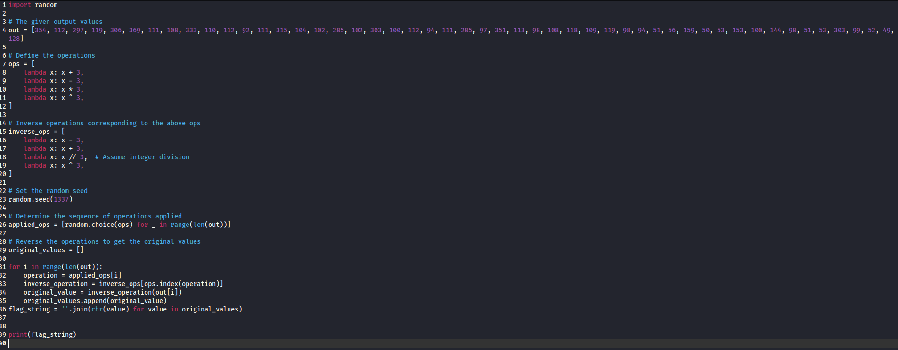

# not-quite-caesar

I download the zip file and view it in my Kali Linux VM. Inside the zip file there is a folder called dist that contains two files: nqc.py and out.txt. nqc.py contains:

While out.txt contains:

Using the provided code and values, I prompt ChatGPT to create a script that reverse engineers the encryption process and output the flag. 

[script](../scripts/not-quite-caeser-solve.py)

