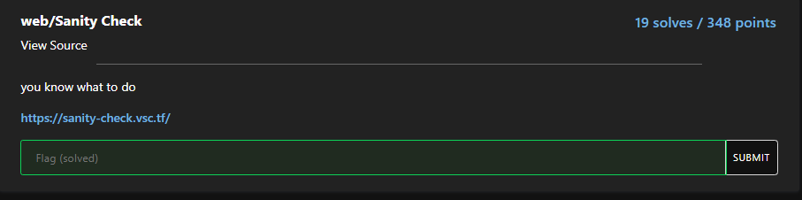
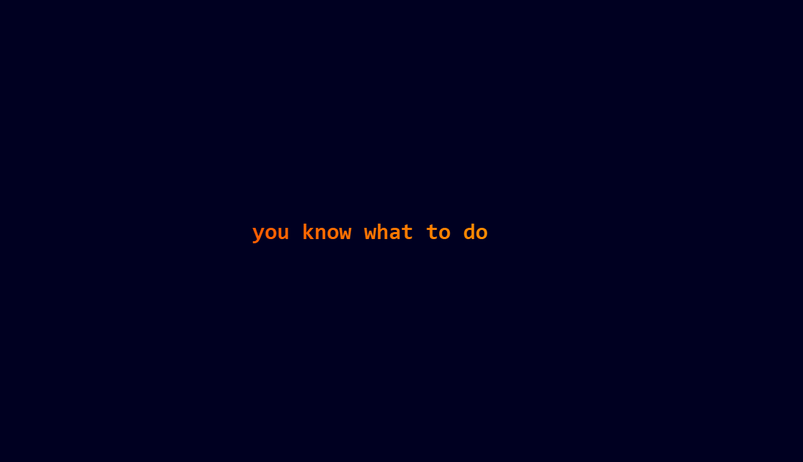
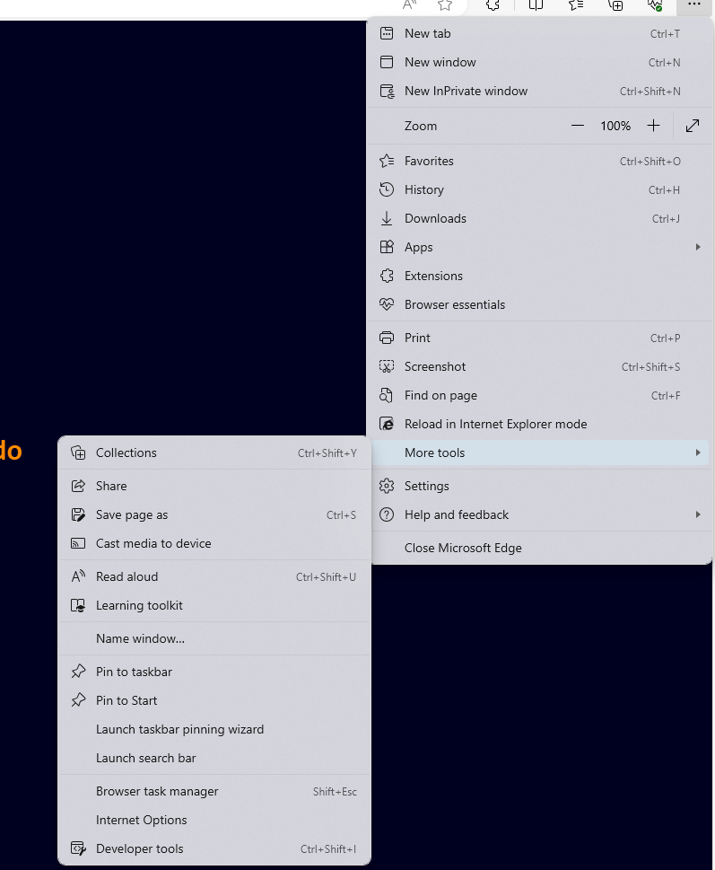
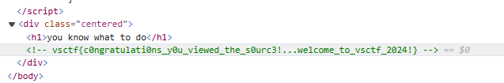

# Sanity Check

I click on the link and it takes me to this webpage:

However, when I try to right-click on the page to inspect element, nothing happens. I then try hitting F12 to open DevTools, but again nothing happens. Seems like the website blocks all user input. In order to get around this limitation, I click on the 3 dots located in the top right of Microsoft Edge's toolbar, and from there I navigate to DevTools:

I then open DevTools, and look through the webpage's source code, where I notice:

I then submit `vsctf{c0ngratulati0ns_y0u_viewed_the_s0urc3!...welcome_to_vsctf_2024!}` and solve the challenge.
