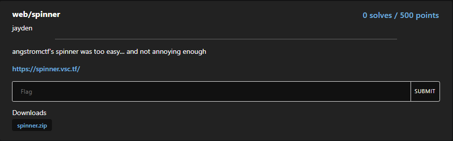
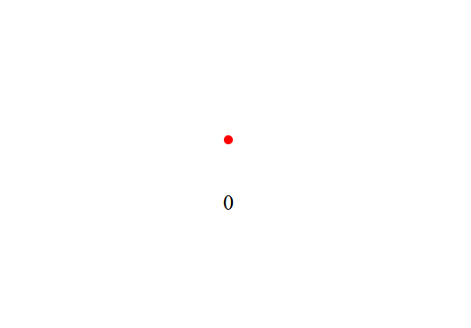
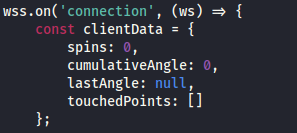
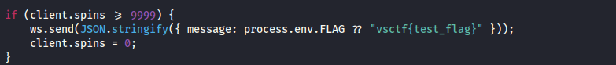

# spinner


I downloaded the files and then clicked on the link, which took me to this webpage:



Moving the mouse in a clockwise direction would increase the "spin" count by one. After playing around for a bit, I decided to take a look at the included files:

In index.js, I noticed:



along with:



With this information I thought I had a general idea of what I needed to do. I would simply modify a websocket in Burpsuite that change the number of spins from 0 to 10000. From there I would be able to access the flag. Unfortunately for me, when I opened up Burpsuite, I noticed that while the client would send the mouse movements, only the server would send back the number of spins. Therefore I wouldn't be able to change the number of spins, as it is not client-side. However, I could create a script that would automate the spinning process, as the client sends the mouse movement. From there I could make the mouse movement a ridculous speed, so that I wouldn't have to wait forever to reach 10,000 spins. So I instructed ChatGPT to write me a script, and after many prompts, I was able to obtain a script. I then modified it slightly, increasing the mouse movement speed and the amount of angles. 

```txt
// Calculate center coordinates
const midX = window.innerWidth / 2;
const midY = window.innerHeight / 2;
const centerElem = document.getElementById('centerPoint');
const spinsDisplay = document.getElementById('spinCount');

// Set the position of the center element
centerElem.style.left = midX - 5 + 'px';
centerElem.style.top = midY - 5 + 'px';

// Initialize the WebSocket connection
const spinSocket = new WebSocket(`wss://${window.location.host}/ws`);

const messageQueue = [];

// Send all queued messages when the WebSocket is open
spinSocket.addEventListener('open', () => {
    console.log('WebSocket connection established');
    while (messageQueue.length > 0) {
        spinSocket.send(messageQueue.shift());
    }
});

// Handle incoming messages
spinSocket.addEventListener('message', (event) => {
    const receivedData = JSON.parse(event.data);
    if (receivedData.spins !== undefined) {
        spinsDisplay.textContent = `${receivedData.spins}`;
    }
    if (receivedData.message) {
        alert(receivedData.message);
    }
});

// Function to queue or send messages
function queueOrSend(message) {
    const messageStr = JSON.stringify(message);
    if (spinSocket.readyState === WebSocket.OPEN) {
        spinSocket.send(messageStr);
    } else {
        messageQueue.push(messageStr);
    }
}

// Function to simulate mouse movement and send data through WebSocket
function performMouseSimulation(cycles, distance) {
    let currentAngle = 0;

    function sendMouseData() {
        const radian = currentAngle * (Math.PI / 180);
        const posX = midX + distance * Math.cos(radian);
        const posY = midY + distance * Math.sin(radian);

        const payload = {
            x: posX,
            y: posY,
            centerX: midX,
            centerY: midY
        };

        queueOrSend(payload);

        currentAngle += 1000000000000000000000000000000000000000000000000000000000000000000000 // modified part, changed value from 10 to 1000000000000000000000000000000000000000000000000000000000000000000000. Adjust this value to control the speed of the simulation

        if (currentAngle < 360 * cycles) {
            requestAnimationFrame(sendMouseData);
        }
    }

    sendMouseData();
}

// Start the simulation with the desired number of iterations and radius
performMouseSimulation(10000, 100000000000000000000000); // modified this part, changed from 100 to 100000000000000000000000. 
```
