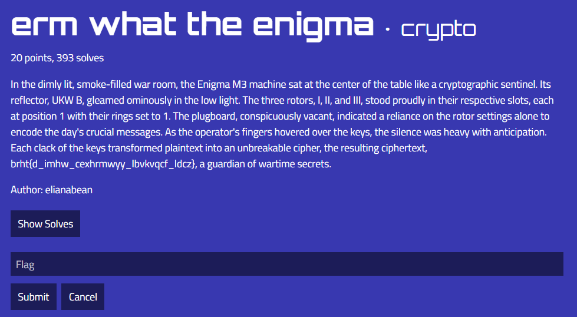
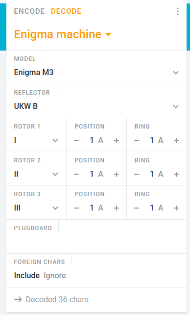

# erm what the enigma


This is the flag that needs to be decoded:

```txt
brht{d_imhw_cexhrmwyy_lbvkvqcf_ldcz}
```

Since the challenge name has the word `engima` in it, and it is a crypto challenge, I can reasonbly assume that in order to decode the flag I will have to use an engima decoder. However the engima machine has many settings that need to be tuned in order to work. If I accidentially set something wrong, I would get an incorrect decoding. So I scanned the the challenge text for clues, and came across this interesting snippet:



Seems like in order to decode the flag:
```txt
1. An Engima M3 machine must be used
2. The reflector must be a UKW B reflector
3. Rotors must be set to use rotors I, II, and III
4. The rotors must be set to position 1
5. The rings must be set to 1
6. Only the rotor settings are used, nothing else
```
Using this information, 

