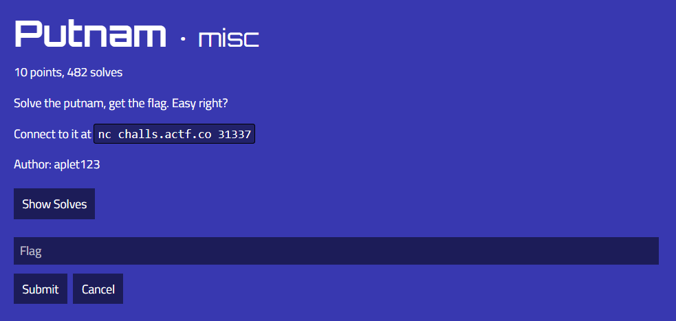
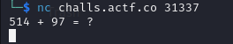
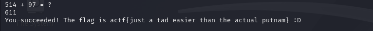

# Putnam

I connected to the challenge using the command
```txt
nc challs.actf.co 31337
```
which displayed:



Seems like a simple math problem. However, from past experience with CTFs (especially challenges I wasn't able to solve), looks can be decieving. However, it is also easy to overthink simple problems, convincing yourself that they are much more complicated than they actually are. So I used a calculator to compute `514 + 97`, which resulted in `611` as the answer. I then typed `611` in the terminal and pressed enter, which resulted in:



I then submitted `actf{just_a_tad_easier_than_the_actual_putnam}` as the flag and solved the challenge.
