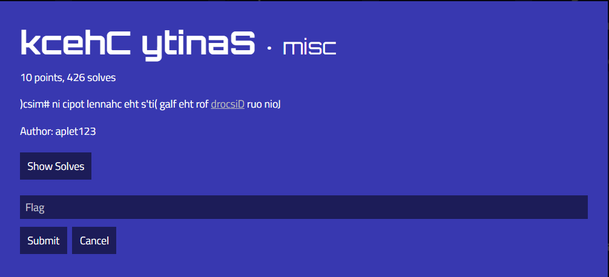
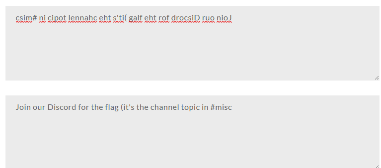
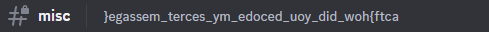
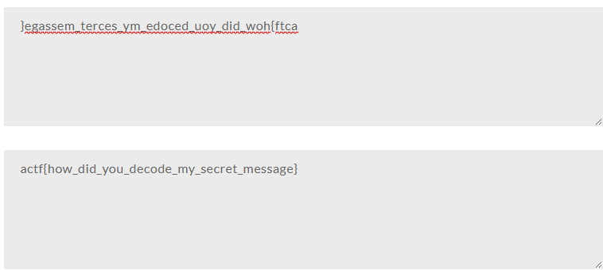

# kcehC ytinaS

The first thing I noticed was that the text seemed to be reversed, so I put the text into a text reverser, which resulted in:

I joined the Discord server, and went to misc. Looking at the channel topic, I saw:

The channel topic seems to be reversed, so I put the channel topic into a text reverser, which resulted in:

I then submitted `actf{how_did_you_decode_my_secret_message}` as the flag and solved the challenge.
