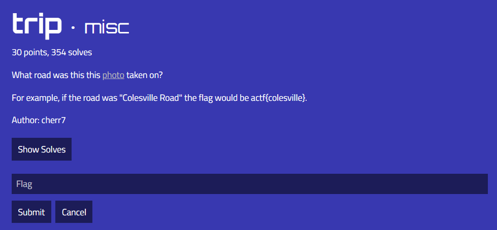
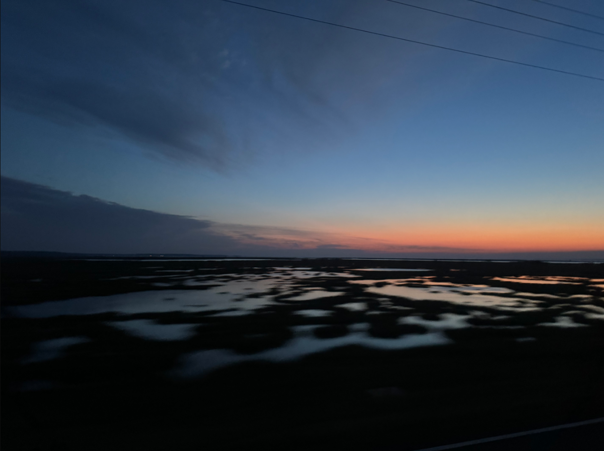

# trip

The file in question:

It's a nice picture. However I need to find where it was taken. My first train of thought was to use `Geocords.com`, an online Exif viewer that tells you where the photo was taken. It's very helpful for OSINT challenges like this one, but only if the Exif location data is still in the image. Most of the times there isn't any Exif location data as it has been stripped out by the challenge author to make the challenge harder. Which makes sense as if the Exif location data is present in the image, it will tell the viewer the exact coordinates where the photo was taken. So I uploaded the image to `Geocords.com`, which resulted in:

Guess it was my lucky day today. I then submitted `actf{chincoteague}` as the flag and solved the challenge.
