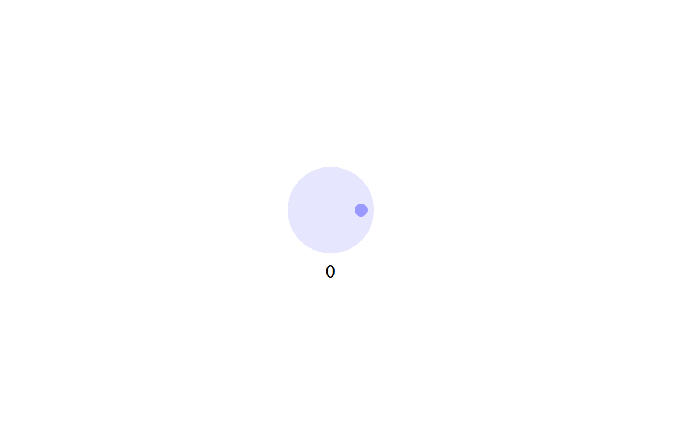
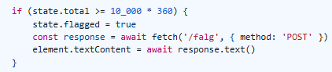
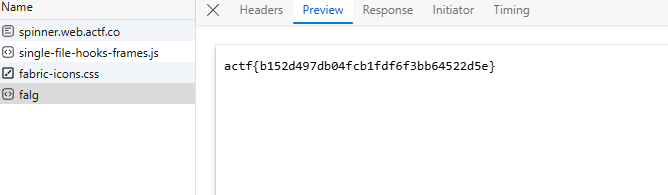

# spinner


I click on the link, which then takes me to a webpage that displays:



If I spin the spinner in a clockwise direction, the value increases by 1, but if I spin it in the counter-clockwise direction, the value decreases by 1. I will need to spin this spinner 10,000 times to get the flag, which would be very tedious. So instead I used Edge DevTools to see if there is anything in the source code of the website that would let me take a shortcut. While looking through the source code I found something interesting:



Seems like once the the value of spins hits 10,000 the program using a fetch command to POST the flag onto the website. Since it is fetching the flag, that must mean that the flag is already on the current webpage. I just need to access it. So I typed:

```txt
fetch ('/falg', {method: POST})
```
in the DevTools console and hit enter, but nothing changed. So I checked the network tab of DevTools to see if anything was sent:



I then submitted `actf{b152d497db04fcb1fdf6f3bb64522d5e}` as the flag and solved the challenge.
