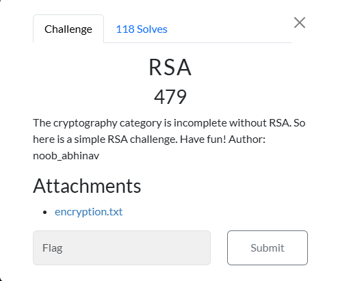

# RSA



I downloaded `encryption.txt` and placed it on my Kali Linux VM in a folder titled `RSA`. `encryption.txt` contained:

```txt
e = 3
n = 135112325288715136727832177735512070625083219670480717841817583343851445454356579794543601926517886432778754079508684454122465776544049537510760149616899986522216930847357907483054348419798542025184280105958211364798924985051999921354369017984140216806642244876998054533895072842602131552047667500910960834243
c = 13037717184940851534440408074902031173938827302834506159512256813794613267487160058287930781080450199371859916605839773796744179698270340378901298046506802163106509143441799583051647999737073025726173300915916758770511497524353491642840238968166849681827669150543335788616727518429916536945395813
```

Since this was an RSA challenge, I was able to use `RsaCtfTool`. In order to use `RsaCtfTool`, I typed:

```txt
python3 RsaCtfTool.py -n 135112325288715136727832177735512070625083219670480717841817583343851445454356579794543601926517886432778754079508684454122465776544049537510760149616899986522216930847357907483054348419798542025184280105958211364798924985051999921354369017984140216806642244876998054533895072842602131552047667500910960834243 -e 3 --decrypt 13037717184940851534440408074902031173938827302834506159512256813794613267487160058287930781080450199371859916605839773796744179698270340378901298046506802163106509143441799583051647999737073025726173300915916758770511497524353491642840238968166849681827669150543335788616727518429916536945395813
```

Which resulted in:

```txt
Decrypted data :
HEX : 0x6e3030627a7b6372797074305f31735f316e63306d706c3374335f773174683075745f72733421217d
INT (big endian) : 235360648501923597413504426673122110620436456645077837051697081536135487875222175025616363200782717
INT (little endian) : 267274803801739728615674650006248742190143184448285803664400617962080516309180649444183969553723502
utf-8 : n00bz{crypt0_1s_1nc0mpl3t3_w1th0ut_rs4!!}
STR : b'n00bz{crypt0_1s_1nc0mpl3t3_w1th0ut_rs4!!}'
```
I then submitted ` n00bz{crypt0_1s_1nc0mpl3t3_w1th0ut_rs4!!}`, and solved the challenge. 

