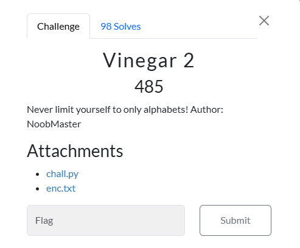

# Vinegar 2




I downloaded `chall.py` and `enc.txt` onto my Kali Linux VM and placed them in a folder titled `Vinegar 2`. `chall.py` contained:

```txt
alphanumerical = 'abcdefghijklmnopqrstuvwxyzABCDEFGHIJKLMNOPQRSTUVWXYZ1234567890!@#$%^&*(){}_?'
matrix = []
for i in alphanumerical:
	matrix.append([i])

idx=0
for i in alphanumerical:
	matrix[idx][0] = (alphanumerical[idx:len(alphanumerical)]+alphanumerical[0:idx])
	idx += 1

flag=open('../src/flag.txt').read().strip()
key='5up3r_s3cr3t_k3y_f0r_1337h4x0rs_r1gh7?'
assert len(key)==len(flag)
flag_arr = []
key_arr = []
enc_arr=[]
for y in flag:
	for i in range(len(alphanumerical)):
		if matrix[i][0][0]==y:
			flag_arr.append(i)

for y in key:
	for i in range(len(alphanumerical)):
		if matrix[i][0][0]==y:
			key_arr.append(i)

for i in range(len(flag)):
	enc_arr.append(matrix[flag_arr[i]][0][key_arr[i]])
encrypted=''.join(enc_arr)
f = open('enc.txt','w')
f.write(encrypted)
```

While `enc.txt` contained:

```txt
*fa4Q(}$ryHGswGPYhOC{C{1)&_vOpHpc2r0({
```

So, I crafted this ChatGPT prompt:

```txt
Using this code: alphanumerical = 'abcdefghijklmnopqrstuvwxyzABCDEFGHIJKLMNOPQRSTUVWXYZ1234567890!@#$%^&*(){}_?' matrix = [] for i in alphanumerical: matrix.append([i]) idx=0 for i in alphanumerical: matrix[idx][0] = (alphanumerical[idx:len(alphanumerical)]+alphanumerical[0:idx]) idx += 1 flag=open('../src/flag.txt').read().strip() key='5up3r_s3cr3t_k3y_f0r_1337h4x0rs_r1gh7?' assert len(key)==len(flag) flag_arr = [] key_arr = [] enc_arr=[] for y in flag: for i in range(len(alphanumerical)): if matrix[i][0][0]==y: flag_arr.append(i) for y in key: for i in range(len(alphanumerical)): if matrix[i][0][0]==y: key_arr.append(i) for i in range(len(flag)): enc_arr.append(matrix[flag_arr[i]][0][key_arr[i]]) encrypted=''.join(enc_arr) f = open('enc.txt','w') f.write(encrypted) Which is a custom Vinegre cipher that uses lowercase letters, numbers, and symbols, decode this: *fa4Q(}$ryHGswGPYhOC{C{1)&_vOpHpc2r0({
```

Which resulted in this script:

```txt
# Given alphanumerical string
alphanumerical = 'abcdefghijklmnopqrstuvwxyzABCDEFGHIJKLMNOPQRSTUVWXYZ1234567890!@#$%^&*(){}_?'

# Recreate the matrix
matrix = []
for i in alphanumerical:
    matrix.append([i])

idx = 0
for i in alphanumerical:
    matrix[idx][0] = (alphanumerical[idx:len(alphanumerical)] + alphanumerical[0:idx])
    idx += 1

# Given ciphertext
ciphertext = '*fa4Q(}$ryHGswGPYhOC{C{1)&_vOpHpc2r0({'
# Given key
key = '5up3r_s3cr3t_k3y_f0r_1337h4x0rs_r1gh7?'

# Ensure the length of the key matches the length of the ciphertext
assert len(key) == len(ciphertext)

# Convert key to indices
key_arr = []
for y in key:
    for i in range(len(alphanumerical)):
        if matrix[i][0][0] == y:
            key_arr.append(i)

# Decrypt ciphertext
decrypted_arr = []
for i in range(len(ciphertext)):
    encrypted_char = ciphertext[i]
    key_index = key_arr[i]
    
    # Find the row in the matrix that contains the encrypted_char at the position key_index
    for row in matrix:
        if row[0][key_index] == encrypted_char:
            decrypted_arr.append(row[0][0])
            break

# Join the decrypted characters to form the original message
decrypted_message = ''.join(decrypted_arr)
print(decrypted_message)
```

I copied and pasted the script into a python file which I named `vinegar2_solve.py`, and then executed the script, which resulted in:

```txt
n00bz{4lph4num3r1c4l_1s_n0t_4_pr0bl3m}
```

I then submitted ` n00bz{4lph4num3r1c4l_1s_n0t_4_pr0bl3m}`, and solved the challenge.


