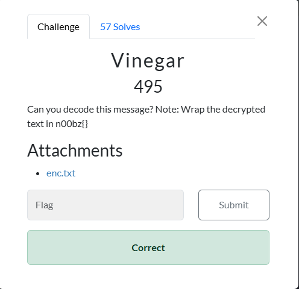
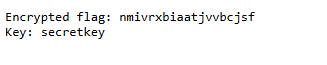
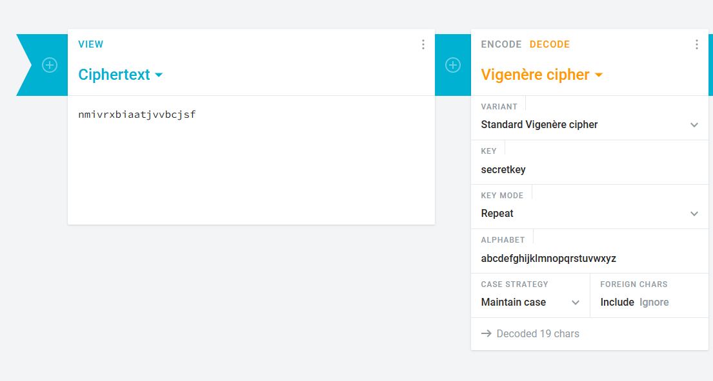

# Vinegar



I click on `enc.txt`, which takes me to a new tab that displays:



Now, this challenge seems very similar to the `Vinegar` challenge in BCACTF-5. So, I go to `cryptii.com` and use their Vinegere Cipher Decoder, inputting the encrypted text and the key into the respective fields:



I then click on `decode`, which results in:

```txt
vigenerecipherisfun
```

I then submit `n00bz{vigenerecipherisfun}` and solve the challenge.

