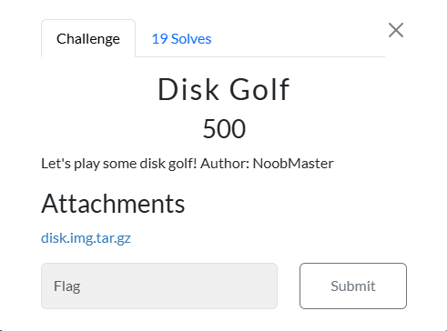
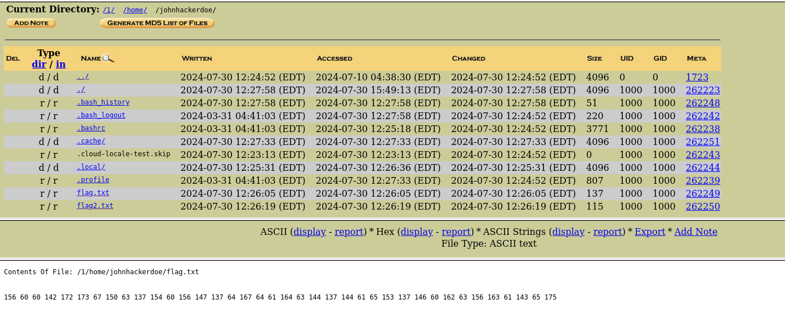
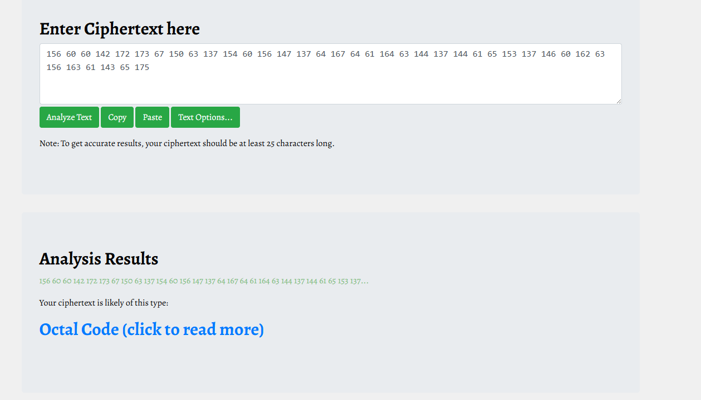
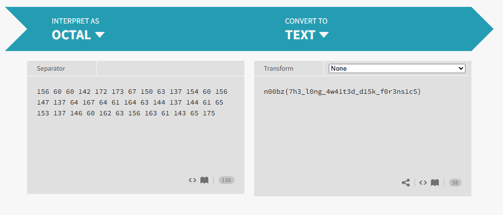

# Disk Golf



I downloaded the file onto my Kali Linux VM and extracted it, which caused a 2.7gb file called `disk.img` to appear. In order to view the file, I used autopsy:



`flag.txt` contains:
```txt
156 60 60 142 172 173 67 150 63 137 154 60 156 147 137 64 167 64 61 164 63 144 137 144 61 65 153 137 146 60 162 63 156 163 61 143 65 175
```

While `flag2.txt` contains:
```txt
This flag was added after the memory dump was created! I wish there was a way to access the current file system ;)
```
I already mounted the image so `flag.txt` is the flag. I then used boxentriq’s cipher identifier:



 I then used `cryptiis` octal code decoder, which resulted in:

 

 I then submitted `n00bz{7h3_l0ng_4w41t3d_d15k_f0r3ns1c5}` and solved the challenge.

