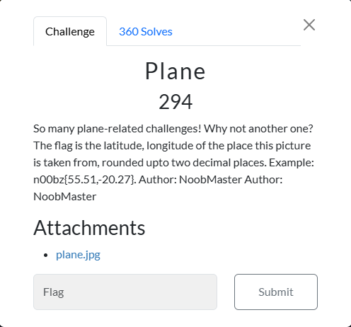
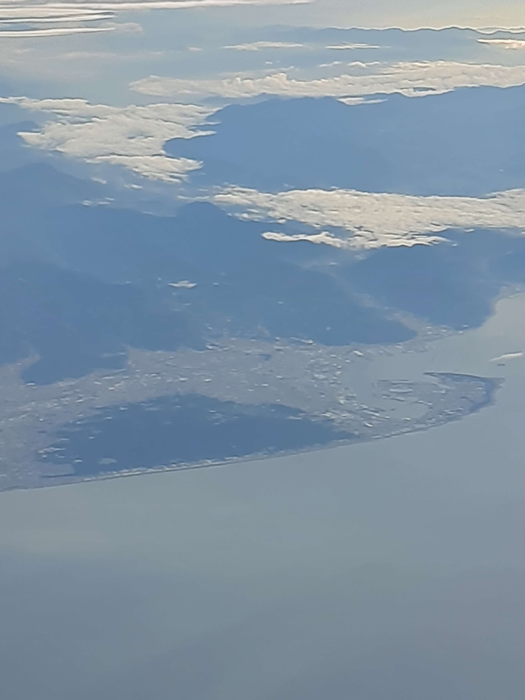
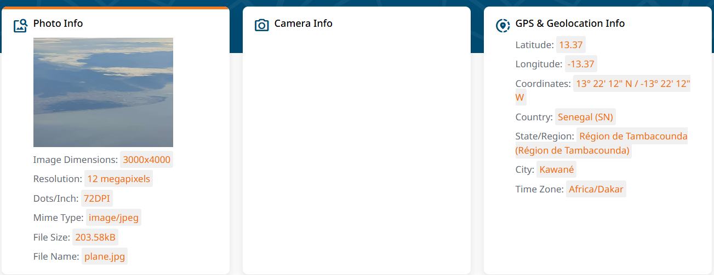

# Plane

I clicked on `plane.jpeg', which revealed:

I downloaded `plane.jpeg` onto my Kali Linux VM and uploaded it to `Geocords.com`, which resulted in:

I then submitted `n00bz{13.37,-13.37}`, and solved the challenge.
