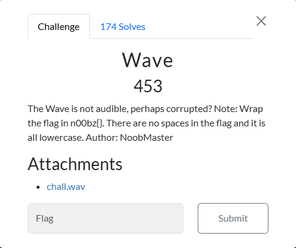
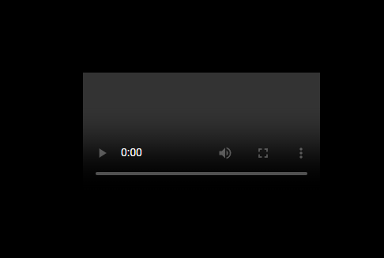
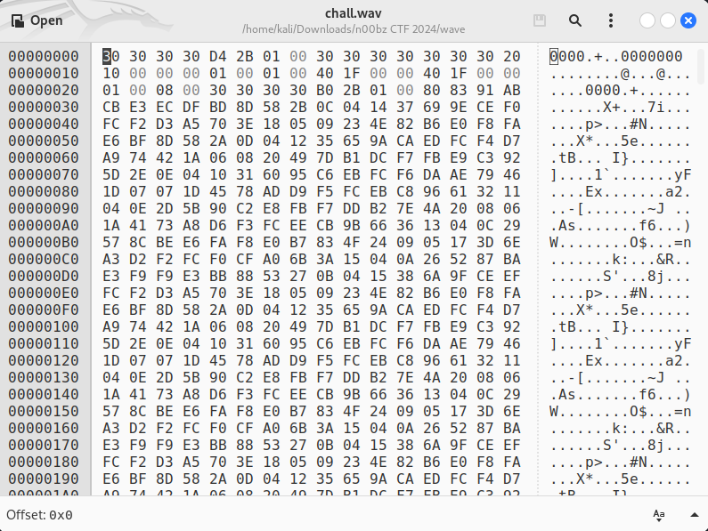
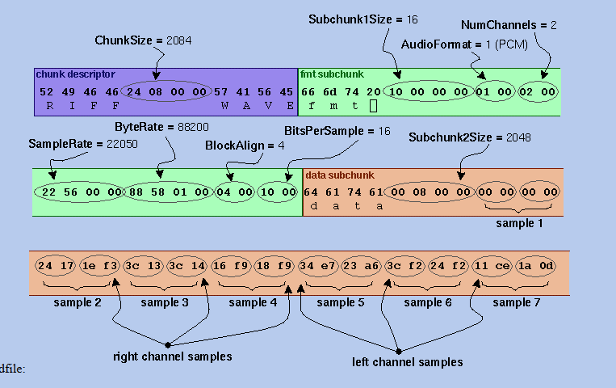
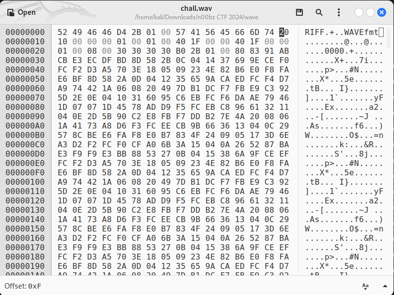
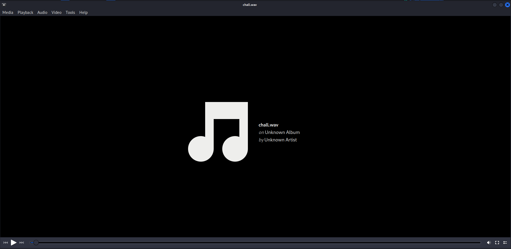
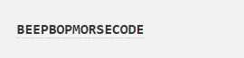

# Wave



I clicked on `chall.wav`, which took me to:



Unfortunately for me, `chall.wav` was corrupted. Additionally, I couldn't find a way to download the `chall.wav` directly from my browser. So, I used `filegrab.net`’s file download from URL feature to download `chall.wav` onto my Kali Linux VM. I then opened `chall.wav` in `ghex`, as from my past experiences with forensics challenges where a file is corrupted, the fix was almost always changing the hexadecimal data of the file with the correct headers in order to uncorrupt the file. 


 
Since `chall.wav` was a `.wav` file, I needed to find the file signature for `.wav` files. So, I searched `.wav file signature` on Google and found this from `https://soundfile.sapp.org/doc/WaveFormat/`:



I could now see what was wrong. The first four bytes of the `chunk descripter` need to be changed from:

```txt
30 30 30 30
```

To:

```txt
52 49 46 46
```

Next, the last four bytes of the `chunk descripter` need to be changed from:

```txt
30 30 30 30
```

To:

```txt
57 41 56 45
```

Finally, the first three bytes of the `format subchunk` header need to be changed from:

```txt
30 30 30
```

To:

```txt
66 6D 74
```

So, in `ghex`, I went to work:


 
I then saved `chall.wav`, and opened it:


 
I heard a series of beeps, which sounded like morse code, so I uploaded the `chall.wav` to ` morsecode.world/international/decoder/audio-decoder-adaptive.html`, which resulted in:


 
Due to the challenge description specifying that the inside of the flag is in lowercase, I changed `BEEPBOPMORSECODE` to `beepbopmorsecode`. I then submitted `n00bzctf{beepbopmorsecode}`, and solved the challenge.

