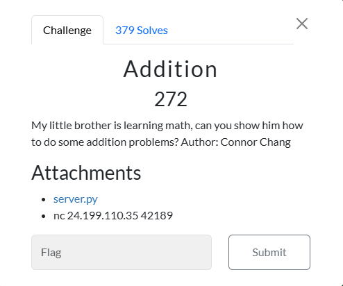

# Addition



I clicked on `server.py`, which took me to a webpage that displayed:
```txt
import time
import random

questions = int(input("how many questions do you want to answer? "))

for i in range(questions):
    a = random.randint(0, 10)
    b = random.randint(0, 10)

    yourans = int(input("what is " + str(a) + ' + ' + str(b) + ' = '))

    print("calculating")

    totaltime = pow(2, i)

    print('.')
    time.sleep(totaltime / 3)
    print('.')
    time.sleep(totaltime / 3)
    print('.')
    time.sleep(totaltime / 3)

    if yourans != a + b:
        print("You made my little brother cry 😬")
        exit(69)

f = open('/flag.txt', 'r')
flag = f.read()
print(flag[:questions])

```

I then typed:

```txt
nc 24.199.110.35 42189
```

To connect to the service. Looking at `server.py` I noticed:

```txt
print(flag[:questions])
```

Therefore, I need to choose the number of questions that will print out the entire flag. However:

```txt
for i in range(questions):
    a = random.randint(0, 10)
    b = random.randint(0, 10)

    yourans = int(input("what is " + str(a) + ' + ' + str(b) + ' = '))

    print("calculating")

    totaltime = pow(2, i)

    print('.')
    time.sleep(totaltime / 3)
    print('.')
    time.sleep(totaltime / 3)
    print('.')
    time.sleep(totaltime / 3)

```

As the number of questions increases, the amount of time the server sleeps before the next question is asked increases. This could take a long time. But:

```txt
questions = int(input("how many questions do you want to answer? "))
```

The number of questions is based off user input. As a result, I entered `-1` for the amount of questions, as an index of -1 would correspond to the last character, therefore printing the flag out from the first character of the flag, to the last character of the flag:

```txt
how many questions do you want to answer? -1
n00bz{m4th_15nt_4ll_4b0ut_3qu4t10n5}
```

I then submitted `n00bz{m4th_15nt_4ll_4b0ut_3qu4t10n5}` and solved the challenge.

